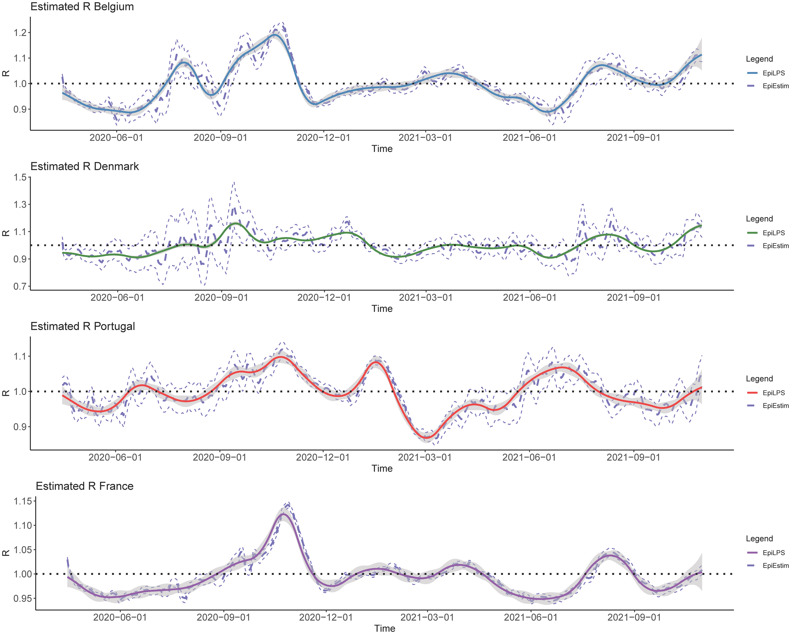
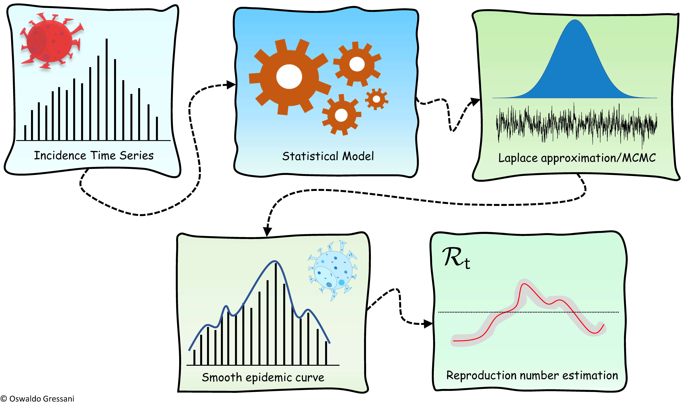

```{r setup, include=FALSE}
knitr::opts_chunk$set(
  fig.align = "center",
  out.width = "100%",
  tidy = "styler",
  warning = FALSE,
  message = FALSE
)
```

{width=100%}

# Introduction

A colleague (and friend) of mine recently published a research paper entitled "EpiLPS: A fast and flexible Bayesian tool for estimation of the time-varying reproduction number" in PLoS Computational Biology.

I am not in the habit of sharing research paper to which I did not contribute. Nevertheless, I would like to make an exception with this one because I strongly believe that the method developed in the paper deserves to be known, especially for anyone working in epidemiology.

Below is the motivation behind the article, as well as an illustration on simulated and real data (US hospitalization data). More information can be found in the [paper](https://journals.plos.org/ploscompbiol/article?id=10.1371/journal.pcbi.1010618) and on the accompanying [website](https://epilps.com/).

# Motivation

EpiLPS [@gressani2022epilps] is a methodology for flexible Bayesian inference of the time-varying reproduction number $\mathcal{R}_t$; the average number of secondary cases generated by an infected agent at time $t$. This is a key epidemiological parameter that informs about the transmission potential of an infectious disease and can be used by public health authorities to gauge the effectiveness of interventions and propose an orientation for future control strategies.

This metric has gained in popularity during the SARS-CoV-2 pandemic with wide media coverage as its meaning is easily and intuitively grasped. Put simply, when $\mathcal{R} < 1$, the signal is encouraging as the epidemic is under control and will eventually vanish. On the contrary, a value of $\mathcal{R} > 1$ means that the disease keeps spreading and infections are witnessing an expansionary impact. Having a robust and reliable tool to compute the reproduction number from infectious disease data is therefore crucial.

A group of researchers in the EpiPose team from Hasselt University (Belgium), Leiden University (The Netherlands), and the University of Bern (Switzerland) have recently developed a new methodology for estimating the instantaneous reproduction number from incidence time series data for a given serial interval distribution (the time elapsed between the onset of symptoms in an infector and the onset of symptoms of secondary cases). They termed their approach EpiLPS for "**Epi**demiological modeling with **L**aplacian-**P**-**S**plines" as Laplace approximations and P-splines smoothers are key ingredients that form the backbone of the proposed methodology.

<br>
{width=100%}
<br>

The EpiLPS model assumes that the observed reported cases (by reporting date or date of symptom onset) are governed by a negative binomial distribution. As such, it allows to take the feature of overdispersion into account, contrary to a Poisson model. The epidemic curve is smoothed with P-splines (where posterior estimates of latent variables are computed via Laplace approximations) in a first step and a renewal equation model is used in a second step as a bridge between the reproduction number and the estimated spline coefficients through a "plug-in" method.

The authors also explain the main difference between EpiLPS and EpiEstim, a well established approached for estimating $\mathcal{R}_t$ in real-time developed by @cori2013new and make extensive comparisons between the two approaches under different epidemic scenarios.

An interesting feature of EpiLPS is that the user can choose between a fully "sampling-free" path, where model hyperparameters are fixed at their *maximum a posteriori* (LPSMAP) or a fully stochastic path (LPSMALA) based on a Metropolis-adjusted Langevin algorithm (LPSMALA). Talking about efficiency, routines for Laplace approximations and B-splines evaluations have been coded in C++ and integrated in R via the [Rcpp package](https://www.rcpp.org/), so that the underlying algorithm can be executed in negligible time.

Below, we provide a short example of how to use the EpiLPS routines to estimate $\mathcal{R}_t$.

# Getting started

The EpiLPS package is available from CRAN (see https://cran.r-project.org/web/packages/EpiLPS/index.html) and can be installed from the R console by typing:

```{r installEpiLPS, eval = FALSE}
install.packages("EpiLPS")
```

The package can then be loaded as follows:

```{r loadEpiLPS, eval = TRUE}
library("EpiLPS")
```

The EpiLPS package structure is fairly simple as it consists in a few routines:

- The function `epilps()` is the core routine for fitting the reproduction number.
- With `plot.epilps()`, the user can plot the estimated epidemic curve and $\mathcal{R}_t$.
- Finally, two ancillary routines, `episim()` and `perfcheck()` have been developed to essentially reproduce the simulation results of the associated paper.

# A simulated example

A set of epidemic data can be simulated with the `episim()` routine by specifying a serial interval distribution and by choosing among a set of available patterns for the true reproduction number curve (here we choose pattern number 5 corresponding to a rather wiggly curve).

The simulated outbreak is for a duration of 40 days as specified in the `endepi` option. By setting the option `plotsim = TRUE`, the routine returns a figure summarizing the incidence time series, a bar plot for the specified serial interval distribution and the true underlying reproduction number curve.

```{r Simul-1, fig.align='center', fig.width=14}
set.seed(1234)

SI <- c(0.344, 0.316, 0.168, 0.104, 0.068)
simepidemic <- episim(serial_interval = SI,
                      Rpattern = 5,
                      plotsim = TRUE,
                      verbose = TRUE,
                      endepi = 40)
```

If you want to have an overview of the generated incidence time series, just type:

```{r Simul-2}
simepidemic$y
```

## Smoothing the epidemic curve and estimating $\mathcal{R}_t$

Let us now use the `epilps()` routine to smooth the epidemic curve and estimate the reproduction number.

We will do this through LPSMAP (a fully sampling-free approach) and via LPSMALA (a fully stochastic approach relying on a MCMC algorithm with Langevin dynamics), where we specify a chain of length 10000 and a burn-in of size 4000.

```{r Simul-3}
LPSMAP_fit <- epilps(incidence = simepidemic$y,
                     serial_interval = SI,
                     tictoc = TRUE)

LPSMALA_fit <- epilps(incidence = simepidemic$y, serial_interval = SI, 
                      method = "LPSMALA", chain_length = 10000, burn = 4000)
```

After execution, each routine prints in the console a brief summary of the method that has been requested by the user.

For LPSMALA, it summarizes the chain length, the acceptance rate (should be around 57%) and other basic information. As can be seen from the printed output, the mean reproduction number for the simulated epidemic is around 1.32.

We can now use, say, the `LPSMALA_fit` object together with the `plot()` routine to obtain the smoothed epidemic curve and the estimated reproduction number (by default the credible interval is at a 5% level of significance but this can be changed by the user).

```{r Simul-4, fig.align='center', fig.width=14}
days <- seq(8,40)

#--- Smoothed epidemic curve
gridExtra::grid.arrange(
plot(LPSMALA_fit, plotout = "epicurve", incibars = TRUE, themetype = "light",
     epicol = "darkgreen", cicol = rgb(0.3, 0.73, 0.3, 0.2),
     epititle = "Smoothed epidemic curve", titlesize = 13, barwidth = 0.25),

#--- Estimated reproduction number
plot(LPSMALA_fit, plotout = "rt", theme = "light", rtcol = "black",
     titlesize = 13, Rtitle = "Estimated R (LPSMALA)"), nrow = 1, ncol = 2)
```

The figure can be customized in various ways:

- Users can specify the theme under `themetype`. Available options are `gray` (the default), `classic`, `light` and `dark`.
- Other choices, such as whether or not to show the incidence bars, the color of the credible interval envelope, the color of the smoothed epidemic curve and the estimated reproduction number are also available.

The figure above was generated within the [`ggplot2` package](/blog/graphics-in-r-with-ggplot2/), but there is also another way of extracting information directly from the `LPSMAP_fit` and `LPSMALA_fit` objects. In fact, the estimated reproduction number values and their associated credible interval for each day can be extracted and plotted.

Below, we make the exercise and plot the estimated $\mathcal{R}_t$ obtained with LPSMAP and LPSMALA, respectively and compare it with the true underlying reproduction number curve. The fit is quite good.

```{r Simul-5, fig.align='center', fig.width=14}
par(mfrow = c(1,2))

#--- LPSMAP vs target R
plot(days, sapply(days,simepidemic$Rtrue), type = "l", lwd = 2, ylim = c(0, 4),
     ylab = "Estimated R", xlab = "Time")
polygon(x=c(days,rev(days)), y = c(LPSMAP_fit$epifit$R95CI_low[8:40],
              rev(LPSMAP_fit$epifit$R95CI_up[8:40])), 
        col = rgb(0.23,0.54,1,0.3), border = NA)
lines(days, LPSMAP_fit$epifit$R_estim[8:40], type = "l", col = "cornflowerblue", lwd = 2)
lines(days, sapply(days,simepidemic$Rtrue), type = "l", lwd = 2)

grid(nx = 10, ny = 10)
legend("topright", lty = c(1,1), lwd = c(2,2), 
       col = c("black", "blue",  rgb(0.23, 0.54, 1, 0.3)),
       c("Target R","LPSMAP", "LPSMAP 95% CI"), bty = "n", cex = 0.9)

#--- LPSMALA vs target R
plot(days, sapply(days,simepidemic$Rtrue), type = "l", lwd = 2, ylim = c(0, 4),
     ylab = "Estimated R", xlab = "Time")
polygon(x=c(days,rev(days)), y = c(LPSMALA_fit$epifit$R95CI_low[8:40],
                                   rev(LPSMALA_fit$epifit$R95CI_up[8:40])), 
        col = rgb(1, 0.23, 0.31, 0.3), border = NA)
lines(days, LPSMALA_fit$epifit$R_estim[8:40], type = "l", col = "red", lwd = 2)
lines(days, sapply(days,simepidemic$Rtrue), type = "l", lwd = 2)

grid(nx = 10, ny = 10)
legend("topright", lty = c(1,1), lwd = c(2,2), 
       col = c("black", "red", rgb(1, 0.23, 0.31, 0.3)),
       c("Target R","LPSMALA", "LPSMALA 95% CI"), bty = "n", cex = 0.9)
```

You can access, say, the results of the last week of the epidemic by typing:

```{r Simul-6}
# Estimated R of the last week (with LPSMAP) 
round(tail(LPSMAP_fit$epifit[,1:4],7),3)

# Estimated mean number of cases of the last week (with LPSMAP) 
round(tail(LPSMAP_fit$epifit[,5:7],7))
```

# USA hospitalization data

To illustrate EpiLPS on real data, we download hospitalization data from the `COVID19` package for the USA in the period ranging from 2021-09-01 to 2022-09-01 and apply the `epilps()` routine to estimate the reproduction number.

```{r loadCovid19pkg, eval = FALSE}
install.packages("COVID19")
library("COVID19")
```

```{r USA-1, warning=FALSE, message=FALSE}
# Get data and specify serial interval distribution
USADat <- COVID19::covid19(country="US", level = 1, start = "2021-09-01", 
                  end = "2022-09-01", verbose = FALSE)

si <- c(0.344, 0.316, 0.168, 0.104, 0.068)

inciUSA <- USADat$hosp
dateUSA <- USADat$date
```

We use the `epilps()` routine with method LPSMAP (default) and plot the smoothed epidemic curve and the estimated reproduction number with a 95% credible interval.

```{r USA-2, fig.align='center', fig.width=14}

epifit <- epilps(incidence = inciUSA, serial_interval = si, K = 20)

gridExtra::grid.arrange(
  plot(epifit, dates = dateUSA, datelab = "3m",
       plotout = "epicurve", incibars = FALSE, themetype = "light",
       epicol = "darkgreen", cicol = rgb(0.3,0.73,0.3,0.2),
       epititle = "USA smoothed epidemic curve", titlesize = 13),
plot(epifit, dates = dateUSA, datelab = "3m",
       plotout = "rt", theme = "light", rtcol = "black",
       titlesize = 13, Rtitle = "USA Estimated R"), nrow = 1, ncol = 2)
```

Thanks for reading. I hope you will find the method developed in the paper as useful as I do. Feel free to reach out to me and to the authors if you happen to use it for your own research.

As always, if you have a question or a suggestion related to the topic covered in this article, please add it as a comment so other readers can benefit from the discussion.

# References
