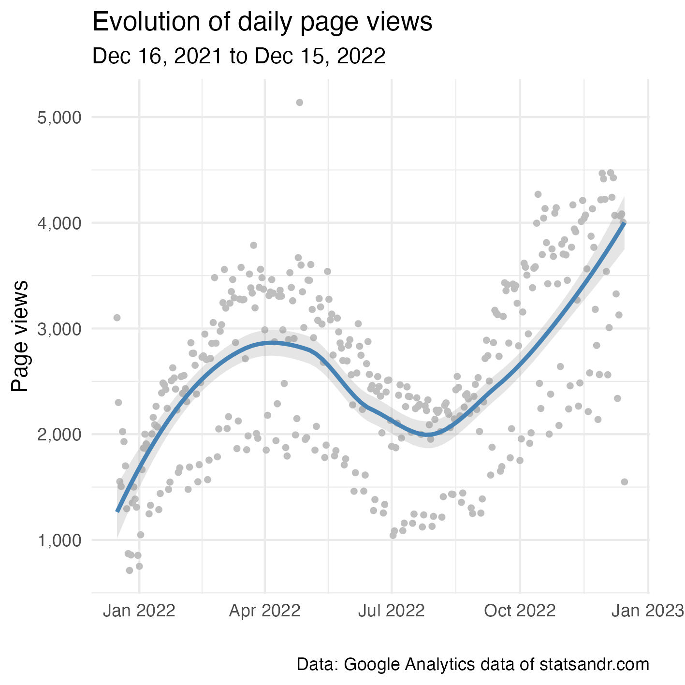
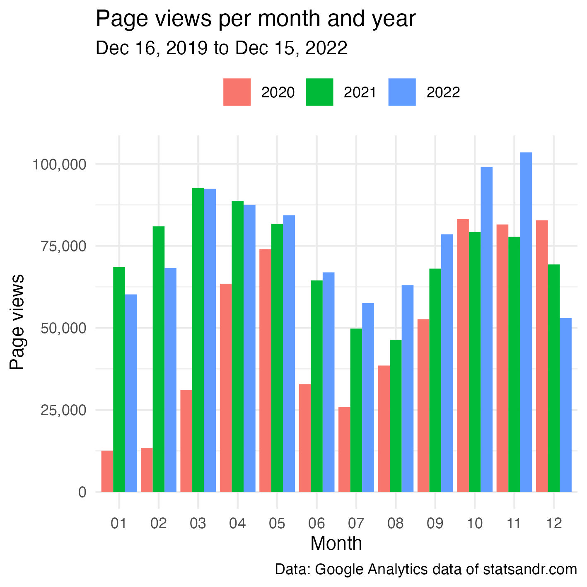
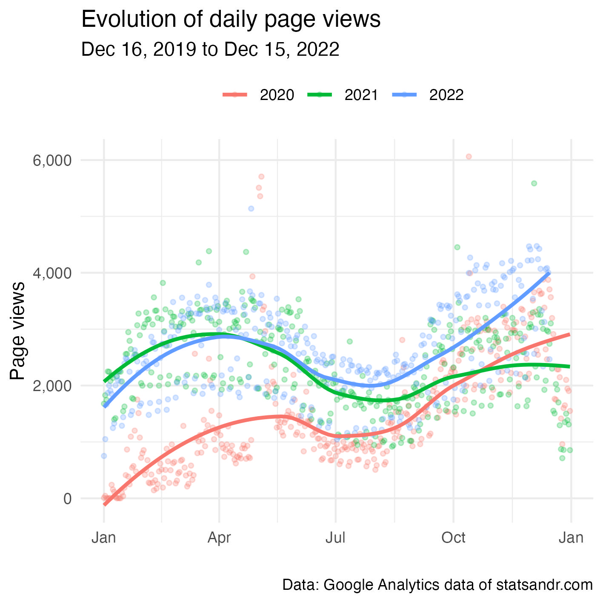
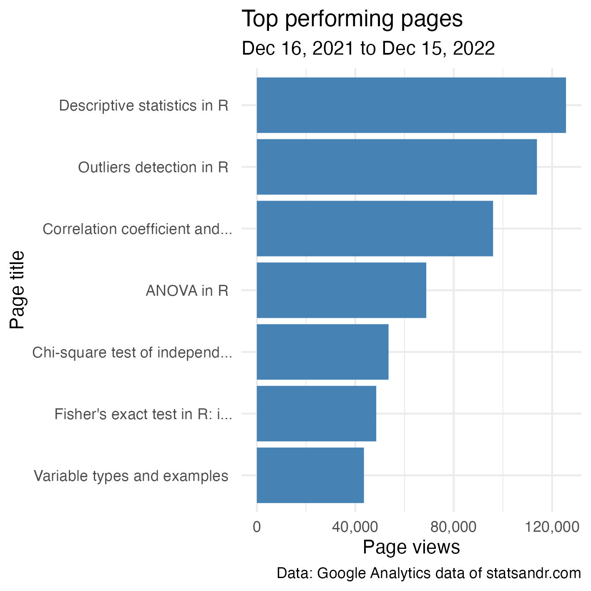
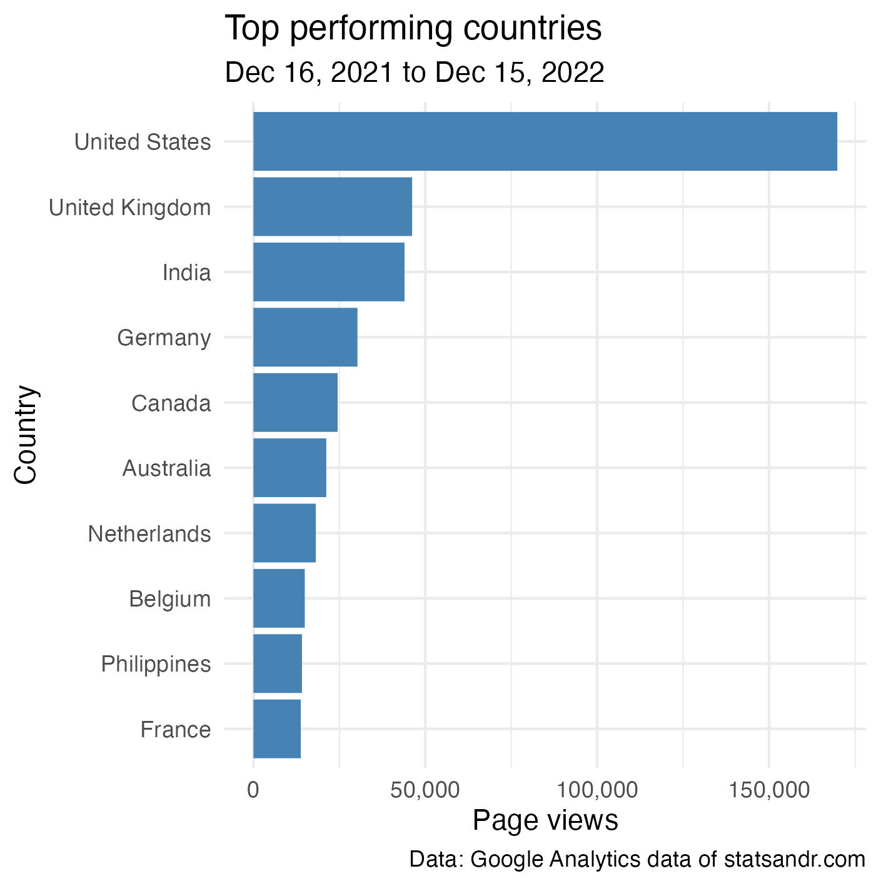
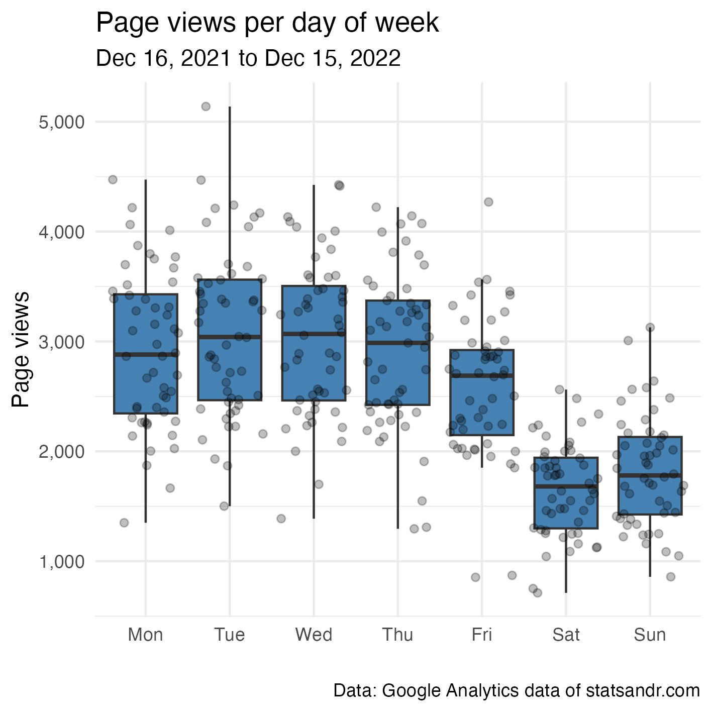

```{r setup, include=FALSE}
knitr::opts_chunk$set(
  fig.align = "center",
  out.width = "100%",
  tidy = "styler",
  warning = FALSE,
  message = FALSE
)

library(googleAnalyticsR)

set.seed(42)
```

```{r, eval = FALSE, echo = FALSE}
# ga_auth()
# ga_auth(json_file="client_secret_1041935229803-ammd9a5buqc28nr2f92go3otkjequqf6.apps.googleusercontent.com.json")

# options(googleAuthR.scopes.selected = "https://www.googleapis.com/auth/analytics.edit")

# specify an email you have already authenticated with once outside of Rmd
ga_auth(email = "googleanalyticsr-ga4@winged-comfort-297013.iam.gserviceaccount.com")
```

{width=100%}

# Introduction

It is almost the end of the year, which means it is time to do a review of Stats and R and look back on the past year.

This year's review will be much shorter compared to previous years because there are already a lot of examples in those [previous reviews](/tags/review/).

Note that beginning of September 2022, I moved from Universal Analytics (known as UA) to Google Analytics 4 (known as GA4). As you may know if you often use Google Analytics; on July 1, 2023, standard Universal Analytics properties will stop processing new hits. This means that you will need to move to GA4 if you want to continue using it after this date.

This year, I will be brief about the different metrics and how to analyze your Google Analytics (GA) data. However, this post will perhaps be helpful for people who also moved (or will move) to GA4 and still want to analyze their GA data from both UA and GA4.

I have to admit that it is quite time consuming to combine data from both, in particular since metrics and dimensions are not the same between UA and GA4. So if you have not moved yet, I recommend doing it at the end or beginning of a year. This will prevent you from having to fetch data from two GA IDs, and then having to combine both data in R.

As usual, I analyze my GA data in R thanks to the amazing `{googleAnalyticsR}` package from [Mark Edmondson](https://code.markedmondson.me/googleAnalyticsR/).

Note that the actual number presented below will not be very useful for you. Every blog and website is different, so every audience is different. This post is more about illustrating the process of analyzing GA data in R (and this year, also to illustrate the process of combining GA data from two GA IDs), rather than about showing my numbers.

# Prerequisites

Before anything else, you have to specify the GA ID for which you want to analyze data. Mine are as follows:

```{r}
ga_id <- c("208126346", "250795226")
```

You will find your(s) in the admin section of your GA account.

# Analytics

In this section, I present some visualizations that might be useful when analyzing your GA data. Feel free to comment at the end of the post if you use other interesting visualizations.

Note that I focus on the page views metrics in this post, but you can edit my code to show other metrics as well. See the metrics available [for UA](https://ga-dev-tools.web.app/dimensions-metrics-explorer/) and the ones [for GA4](https://developers.google.com/analytics/devguides/reporting/data/v1/api-schema).

## Page views over time

Let's start with the evolution of the number of page views over the past year, so from December 16, 2021 to December 15, 2022.

```{r, eval = FALSE}
library(googleAnalyticsR)

# set date range
start_date <- as.Date("2021-12-16")
end_date <- as.Date("2022-12-15")

# extract data from both IDs
dat1 <- google_analytics(ga_id[1],
                 date_range = c(start_date, end_date),
                 metrics = "pageviews",
                 dimensions = "date",
                 anti_sample = TRUE # avoid sampling
                 )

dat2 <- ga_data(ga_id[2],
                 date_range = c(start_date, end_date),
                 metrics = "screenPageViews",
                 dimensions = "date",
               limit = -1 # return all data (no limit)
               )

# combine data from both IDs
library(dplyr)
dat <- full_join(dat1, dat2, by = "date")
dat$page_views <- rowSums(select(dat, pageviews, screenPageViews),
                      na.rm = TRUE)


# scatter plot with a trend line
library(ggplot2)
dat %>%
  ggplot(aes(x = date, y = page_views)) +
  geom_point(size = 1L, color = "gray") + # change size and color of points
  geom_smooth(color = "steelblue", alpha = 0.25) + # change color of smoothed line and transparency of confidence interval
  theme_minimal() +
  labs(
    y = "Page views",
    x = "",
    title = "Evolution of daily page views",
    subtitle = paste0(format(start_date, "%b %d, %Y"), " to ", format(end_date, "%b %d, %Y")),
    caption = "Data: Google Analytics data of statsandr.com"
  ) +
  theme(plot.margin = unit(c(5.5, 17.5, 5.5, 5.5), "pt")) + # to avoid the plot being cut on the right edge
  scale_y_continuous(labels = scales::comma) # better y labels
```

```{r, echo = FALSE, eval = FALSE}
ggsave("/Users/antoinesoetewey/Downloads/page_views.jpeg",
  width = 12,
  height = 12,
  units = "cm",
  dpi = 300
  )
```

{width=100%}

As you can see in the code above, we need to:

- extract data from two different IDs: this is done with `google_analytics()` for UA and `ga_data()` for GA4 (with each function having its own arguments)
- join data from the two IDs (with a `full_join()` because even after moving to GA4, there were still some hits on UA, so I need to keep data from the 2 IDs for the entire year)
- sum up the metric for both IDs (with `rowSums()`)

This process will be done repeatedly for each visualization.

From the plot above, we see that the number of page views follows a cyclical evolution (with a decrease during summer). This trend follows the same pattern than last year, but the increase in the last quarter of the year is larger in 2022.

Note that there seems to be consistently some days with a lower number of page views than the rest. This is actually the weekends. See more on that in this [section](/blog/review-of-2022/#page-views-per-day-of-week). Note also the presence of an [outlier](/blog/outliers-detection-in-r/) with a number of page views above 5,000. No post has been published on that day, so it probably comes from an old post that was shared to a large audience.

Finally, summing all days give a total page views of 938,630. Last year, it was 876,280, so 2022 saw an increase of `r round(((938630 - 876280) / 876280) * 100, 2)`%.

## Page views per month and year

Comparison of the number of page views per month for all previous years can also be useful. Below two different types of visualizations.

```{r, eval = FALSE}
# set new date range to include previous years
start_date_launch <- as.Date("2019-12-16")

# extract data from both IDs
dat1 <- google_analytics(ga_id[1],
                 date_range = c(start_date_launch, end_date),
                 metrics = "pageviews",
                 dimensions = "date",
                 anti_sample = TRUE # avoid sampling
                 )

dat2 <- ga_data(ga_id[2],
                 date_range = c(start_date_launch, end_date),
                 metrics = "screenPageViews",
                 dimensions = "date",
               limit = -1 # return all data (no limit)
               )

# combine data from both IDs
dat <- full_join(dat1, dat2, by = "date")
dat$page_views <- rowSums(select(dat, pageviews, screenPageViews),
                      na.rm = TRUE)


# add year and month columns to dataframe
dat$month <- format(dat$date, "%m")
dat$year <- format(dat$date, "%Y")

# page views by month by year using dplyr then graph using ggplot2 barplot
dat %>%
  filter(year != 2019) %>% # remove 2019 because there are data for December only
  group_by(year, month) %>%
  summarize(page_views = sum(page_views)) %>%
  ggplot(aes(x = month, y = page_views, fill = year)) +
  geom_bar(position = "dodge", stat = "identity") +
  theme_minimal() +
  labs(
    y = "Page views",
    x = "Month",
    title = "Page views per month and year",
    subtitle = paste0(format(start_date_launch, "%b %d, %Y"), " to ", format(end_date, "%b %d, %Y")),
    caption = "Data: Google Analytics data of statsandr.com",
    fill = "" # remove legend title
  ) +
  theme(legend.position = "top") + # change legend position
  scale_y_continuous(labels = scales::comma) # better y labels
```

```{r, echo = FALSE, eval = FALSE}
ggsave("/Users/antoinesoetewey/Downloads/page_views_month.jpeg",
  width = 12,
  height = 12,
  units = "cm",
  dpi = 300
  )
```

{width=100%}

Another possibility is as follows:

```{r, eval = FALSE}
dat2 <- dat

library(lubridate)
dat2$day <- day(dat2$date)
dat2$day_month <- as.Date(paste0(dat2$month, "-", dat2$day), format = "%m-%d")

dat2 %>%
  filter(year != 2019 & page_views < 7500) %>% # remove 2019 and outliers
  ggplot(aes(x = day_month, y = page_views, color = year)) +
  geom_point(size = 1L, alpha = 0.25) + # change size and alpha of points
  geom_smooth(se = FALSE) + # remove confidence interval
  theme_minimal() +
  labs(
    y = "Page views",
    x = "",
    title = "Evolution of daily page views",
    subtitle = paste0(format(start_date_launch, "%b %d, %Y"), " to ", format(end_date, "%b %d, %Y")),
    caption = "Data: Google Analytics data of statsandr.com",
    color = "" # remove legend title
  ) +
  theme(legend.position = "top") + # change legend position
  scale_y_continuous(labels = scales::comma) + # better y labels
  scale_x_date(date_labels = "%b") # show only months
```

```{r, echo = FALSE, eval = FALSE}
ggsave("/Users/antoinesoetewey/Downloads/page_views_month_evolution.jpeg",
  width = 12,
  height = 12,
  units = "cm",
  dpi = 300
  )
```

{width=100%}

From the 2 plots above, we see that the blog globally performed better in terms of page views compared to 2020-2021 (with an exception in the first quarter for which it performed better in 2021).

Note that a comparison between 3 years is fine, but with more years to compare the plots would quickly become unreadable!

## Top performing pages

In case you are interested to know the top performing pages (still in terms of page views):

```{r, eval = FALSE}
# extract data from both IDs
dat1 <- google_analytics(ga_id[1],
                 date_range = c(start_date, end_date),
                 metrics = "pageviews",
                 dimensions = "pageTitle",
                 anti_sample = TRUE # avoid sampling
                 )

dat2 <- ga_data(ga_id[2],
                 date_range = c(start_date, end_date),
                 metrics = "screenPageViews",
                 dimensions = "pageTitle",
               limit = -1 # return all data (no limit)
               )

# combine data from both IDs
dat <- full_join(dat1, dat2, by = "pageTitle")
dat$page_views <- rowSums(select(dat, pageviews, screenPageViews),
                      na.rm = TRUE)

## Create a table of the most viewed posts
library(lubridate)
library(reactable)
library(stringr)


most_viewed_posts <- dat %>%
  mutate(Title = str_sub(pageTitle, start=1, end=-nchar(" - Stats and R"))) %>% # remove blog site in pageTitle
  count(Title, wt = page_views, sort = TRUE) %>%
  mutate(Title = str_trunc(Title, width = 30)) # keep maximum 30 characters

# plot
top_n(most_viewed_posts, n = 7, n) %>% # edit n for more or less pages to display
  ggplot(., aes(x = reorder(Title, n), y = n)) +
  geom_bar(stat = "identity", fill = "steelblue") +
  theme_minimal() +
  coord_flip() +
  labs(
    y = "Page views",
    x = "Page title",
    title = "Top performing pages",
    subtitle = paste0(format(start_date, "%b %d, %Y"), " to ", format(end_date, "%b %d, %Y")),
    caption = "Data: Google Analytics data of statsandr.com"
  ) +
  scale_y_continuous(labels = scales::comma) # better y labels
```

```{r, echo = FALSE, eval = FALSE}
ggsave("/Users/antoinesoetewey/Downloads/top_pages.jpeg",
  width = 12,
  height = 12,
  units = "cm",
  dpi = 300
  )
```

{width=100%}

Top performing posts are quite similar than last year, that is:

1. [Descriptive statistics in R](/blog/descriptive-statistics-in-r/)
1. [Outliers detection in R](/blog/outliers-detection-in-r/)
1. [Correlation coefficient and correlation test in R](/blog/correlation-coefficient-and-correlation-test-in-r/)
1. [ANOVA in R](/blog/anova-in-r/)
1. [Chi-square test of independence in R](/blog/chi-square-test-of-independence-in-r/)

Since they are the most read posts for several years, I have made them available to download via [Gumroad](https://statsandr.gumroad.com/).

## Page views by country

Knowing from which country your readers come from can also be useful, in particular for e-commerce or blogs that sell physical products in addition to writing posts.

```{r, eval = FALSE}
# extract data from both IDs
dat1 <- google_analytics(ga_id[1],
                 date_range = c(start_date, end_date),
                 metrics = "pageviews",
                 dimensions = "country",
                 anti_sample = TRUE # avoid sampling
                 )

dat2 <- ga_data(ga_id[2],
                 date_range = c(start_date, end_date),
                 metrics = "screenPageViews",
                 dimensions = "country",
               limit = -1 # return all data (no limit)
               )

# combine data from both IDs
dat <- full_join(dat1, dat2, by = "country")
dat$page_views <- rowSums(select(dat, pageviews, screenPageViews),
                      na.rm = TRUE)

# table
countries <- dat %>%
  mutate(Country = str_trunc(country, width = 30)) %>% # keep maximum 30 characters
  count(Country, wt = pageviews, sort = TRUE)

# plot
top_n(countries, n = 10, n) %>% # edit n for more or less countries to display
  ggplot(., aes(x = reorder(Country, n), y = n)) +
  geom_bar(stat = "identity", fill = "steelblue") +
  theme_minimal() +
  coord_flip() +
  labs(
    y = "Page views",
    x = "Country",
    title = "Top performing countries",
    subtitle = paste0(format(start_date, "%b %d, %Y"), " to ", format(end_date, "%b %d, %Y")),
    caption = "Data: Google Analytics data of statsandr.com"
  ) +
  scale_y_continuous(labels = scales::comma) + # better y labels
  theme(plot.margin = unit(c(5.5, 7.5, 5.5, 5.5), "pt")) # to avoid the plot being cut on the right edge
```

```{r, echo = FALSE, eval = FALSE}
ggsave("/Users/antoinesoetewey/Downloads/countries.jpeg",
  width = 12,
  height = 12,
  units = "cm",
  dpi = 300
  )
```

{width=100%}

For Stats and R, most readers are from the US, and to a large extent since the second top country (UK) is quite far in terms of page views.

This trend is the same than last years, except that:

- UK has surpassed India, and
- Belgium (which used to rank 3rd and 6th in 2020 and 2021, respectively) is now only 8th. Since I am from Belgium, this indicates that the blog is attracting more and more international readers through the years (and proportionally less and less from my country).

## Page views per day of week

As discussed in the section about the evolution of daily page views (view this [section](/blog/review-of-2022/#page-views-over-time)), there seem to be some days which consistently perform worse than other days.

The following plot will show what are these days:

```{r, eval = FALSE}
# extract data from both IDs
dat1 <- google_analytics(ga_id[1],
                 date_range = c(start_date, end_date),
                 metrics = "pageviews",
                 dimensions = c("date"),
                 anti_sample = TRUE # avoid sampling
                 )

dat2 <- ga_data(ga_id[2],
                 date_range = c(start_date, end_date),
                 metrics = "screenPageViews",
                 dimensions = c("date"),
               limit = -1 # return all data (no limit)
               )

# combine data from both IDs
dat <- full_join(dat1, dat2, by = "date")
dat$page_views <- rowSums(select(dat, pageviews, screenPageViews),
                      na.rm = TRUE)
#find day of week
dat$weekday <- wday(dat$date, label=TRUE, abbr=TRUE)

## Reordering dat$weekday so Monday is first
dat$weekday <- factor(dat$weekday,
  levels = c("Mon", "Tue", "Wed", "Thu", "Fri", "Sat", "Sun")
)

# boxplot
library(scales)
dat %>%
  ggplot(aes(x = weekday, y = page_views)) +
  geom_boxplot(fill = "steelblue", outlier.colour = alpha(0.25)) +
  geom_jitter(alpha = 0.25) + # adds transparency
  theme_minimal() +
  labs(
    y = "Page views",
    x = "",
    title = "Page views per day of week",
    subtitle = paste0(format(start_date, "%b %d, %Y"), " to ", format(end_date, "%b %d, %Y")),
    caption = "Data: Google Analytics data of statsandr.com"
  ) +
  scale_y_continuous(labels = scales::comma) # better y labels
```

```{r, echo = FALSE, eval = FALSE}
ggsave("/Users/antoinesoetewey/Downloads/weekday.jpeg",
  width = 12,
  height = 12,
  units = "cm",
  dpi = 300
  )
```

{width=100%}

As expected for a technical blog, there are much more readers during the week than during the weekend.

# Thank you note

Thank you to all readers who came to Stats and R this year. You made this journey incredibly more enriching. For next year and the many more to come, I will keep writing about topics for which I am familiar and interested in. So stay tuned!

Thanks for reading. I hope this article helped you to analyze your Google Analytics data in R, or helped you to combine your Universal Analytics and Google Analytics 4 data. For more examples of visualizations or summaries of your GA data in R, see also previous years' [reviews](/tags/review/).

As always, if you have a question or a suggestion related to the topic covered in this article, please add it as a comment so other readers can benefit from the discussion.