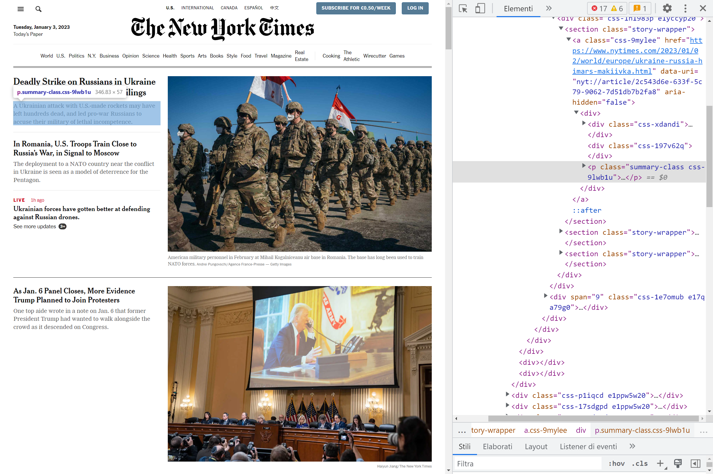
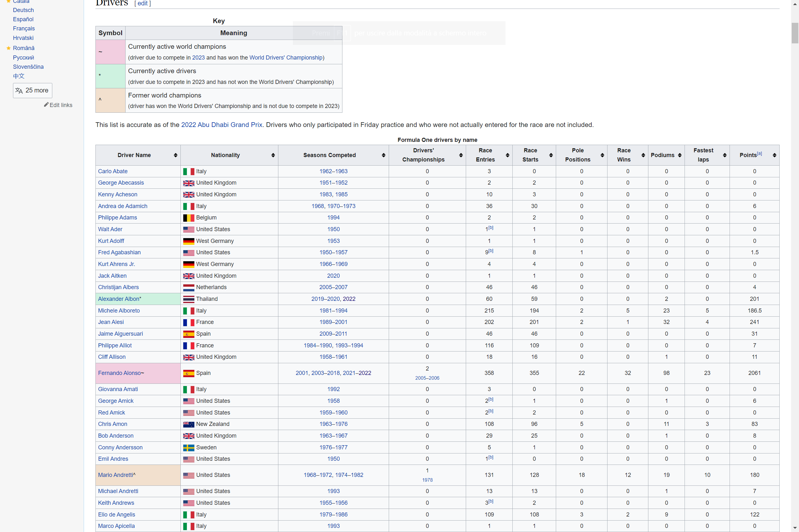
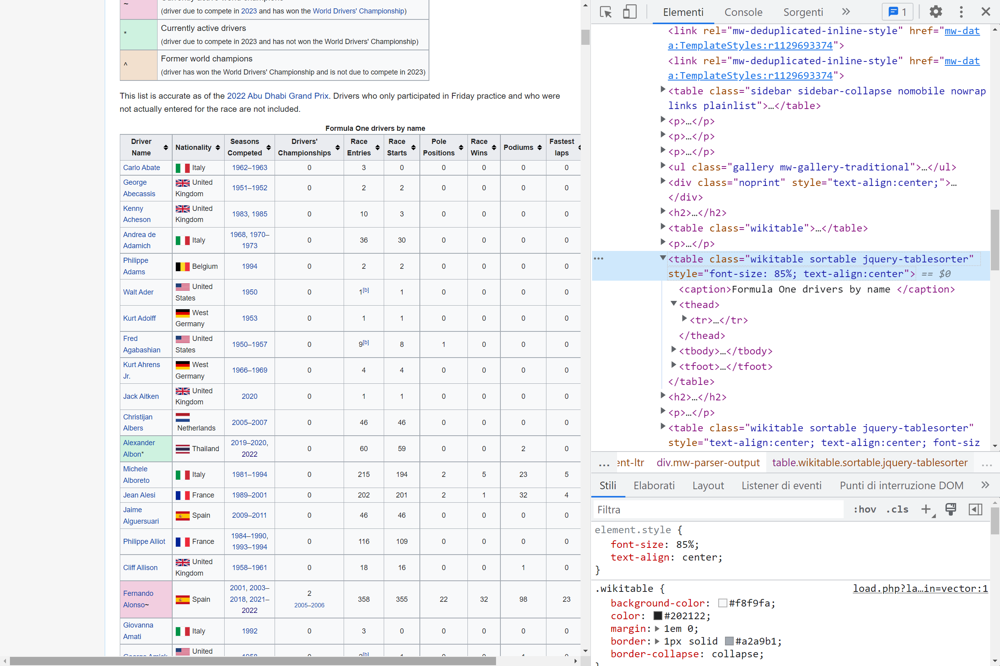

```{r setup, include=FALSE}
knitr::opts_chunk$set(
  fig.align = "center",
  out.width = "100%",
  tidy = "styler",
  warning = FALSE,
  message = FALSE
)

set.seed(42)
```

{width=100%}

*This post has been written in collaboration with [Pietro Zanotta](https://www.zanotp.com/){target="_blank"}.*

# Introduction

Almost anyone is familiar with web pages (otherwise you would not be here), but what if we tell you that how you see a site is different from how Google or your browser does?

In fact, when you type any site address in your browser, your browser will download and render the page for you, but for rendering the page it needs some instructions.

There are 3 types of instructions:

-   **HTML**: describes a web page's infrastructure;
-   **CSS**: defines the appearance of a site;
-   **JavaScript**: decides the behavior of the page.

**Web scraping** is the art of extracting information from the HTML, CSS and Javascript lines of code. The term usually refers to an automated process, which is less error-prone and faster than gathering data by hand.

It is important to note that web scraping can raise **ethical concerns**, as it involves accessing and using data from websites without the explicit permission of the website owner. It is a good practice to respect the terms of use for a website, and to seek written permission before scraping large amounts of data.

This article aims to cover the basics of how to do web scraping in R. We will conclude by creating a database on Formula 1 drivers from [Wikipedia](https://en.wikipedia.org/wiki/List_of_Formula_One_drivers){target="_blank"}.

Note that this article doesn't want to be exhaustive on topic. To learn more, see [this section](/blog/web-scraping-in-r/#to-go-further).

### HTML and CSS

Before starting it is important to have a basic knowledge of HTML and CSS. This section aims to briefly explain how HTML and CSS work, to learn more we leave you some resources at the bottom of this article.

Feel free to skip this section if you already are knowledgeable in this topic.

Starting from **HTML**, an HTML file looks like the following piece of code.

``` html
<!DOCTYPE html>
<html lang="en">
<body>

<h1 href="https://en.wikipedia.org/wiki/Carl_Friedrich_Gauss"> Carl Friedrich Gauss</h1>
<h2> Biography </h2>
<p> Johann Carl Friedrich Gauss was born on 30 April 1777 in Brunswick. </p>
<h2> Profession </h2>
<p> Gauss is considered as one of the greatest mathematician, statistician and physicist of all time. </p>

</body>
</html>
```

Those instructions produce the following:

{width=100%}

As you read above, **HTML** is used to describe the infrastructure of a web page, for example we may want to define the headings, the paragraphs, etc.

This infrastructure is represented by what are called *tags* (for example `<h1>...<\h1>` or `<p>...<\p>` are tags). Tags are the core of an HTML document as they represent the nature of what is inside the tag (for example `h1` stands for heading 1). It is important to observe that there are two types of tags:

-   starting tags (e.g. `<h1>`)
-   ending tags (e.g. `<\h1>`)

This is what allows to nest different tags.

Tags can also have attributes, for example in `<h1 href="https://en.wikipedia.org/wiki/Carl_Friedrich_Gauss"Carl Friedrich Gauss</h1>`, `href` is an attribute of the tag `h1` that specifies an URL.

As the output of the above HTML code is not super elegant, **CSS** is used to style the final website. For example CSS is used to define the font, the color, the size, the spacing and many more features of a website.

What is important for this article are *CSS selectors*, which are patterns used to select elements. The most important is the `.class` selector, which selects all elements with the same class. For example the `.xyz` selector selects all elements with `class="xyz"`.

## Web scraping vs. APIs

Going back to web scraping, you may know that APIs are another way to access data from websites and online services.

In fact an API is a set of rules and protocols that allows two different software systems to communicate with each other. When a website or online service provides an API, it means that they have made it possible for developers to access their data in a structured and controlled way.

### Why does web scraping exist if APIs are so powerful and do exactly the same work?

The main difference between web scraping and using APIs is that APIs are typically provided by the website or service to allow access to their data, while web scraping involves accessing data without the explicit permission of the website owner.

This means that using APIs is generally considered more ethical than web scraping, as it is done with the explicit permission of the website or service.

However, there are also some limitations to using APIs:

-   many APIs have rate limits, which means that they will only allow a certain number of requests to be made within a certain time period, i.e. you may not access large amounts of data;
-   not all websites or online services provide APIs, which means the only way to access their data is via web scraping.

# Web scraping in R

There are several packages for web scraping in R, every package has its strengths and limitations. We will cover only the `rvest` package since it is the most used.

To get started with web scraping in R you will first need R and RStudio installed (if needed, see [here](/blog/how-to-install-r-and-rstudio/)). Once you have R and RStudio installed, you need to install the `rvest` package:

```{r, eval = F}
install.packages("rvest")
```

## rvest

Inspired by `beautiful soup` and `RoboBrowser` (two Python libraries for web scraping), `rvest` has a similar syntax, which makes it the most eligible package for those who come from Python.

`rvest` provides functions to access a web page and specific elements using CSS selectors and XPath. The library is a part of the [Tidyverse](https://www.tidyverse.org/) collection of packages, i.e. it shares some coding conventions (e.g. the pipes) with other libraries as `tybble` and `ggplot2`.

Before the real scraping it is necessary to load the `rvest` package:

```{r}
library(rvest)
```

Now that everything is settled down, we can start the web scraping operation, which is usually made in 3 steps:

1. **HTTP GET request**
1. **Parsing HTML content**
1. **Getting HTML element attributes**

These steps are detailed in the following sections.

## HTTP GET request

The HTTP GET method is a method used to send a server a question to get certain data and information. It is important to notice that this method does not change the state of the server.

To send a GET request we need the link (as a character) to the page we want to scrape:

```{r}
link <- "https://www.nytimes.com/"
```

Sending the request to the page is simple, `rvest` provides the `read_html` function, which returns an object of `html_document` type:

```{r}
NYT_page <- read_html(link)

NYT_page
```

## Parsing HTML content

As we saw in the last chunk of code, `NYT_page` contains the raw HTML code, which is not so easily readable.

In order to make it readable from R it has to be parsed, which means generating a Document Object Model (DOM) from the raw HTML. DOM is what connects scripts and web pages by representing the structure of a document in memory.

`rvest` provides 2 ways to select HTML elements:

1. **XPath**
1. **CSS selectors**

Selecting elements with `rvest` is simple, for XPath we use the following syntax:

```{r, eval=F}
NYT_page %>% 
	html_elements(xpath="")
```

while for CSS elector we need:

```{r, eval=F}
NYT_page %>% 
	html_elements(css="")
```

### CSS selector

Suppose that for a project you need the summaries of the articles of the NYT (note that what is in the following picture is not what you see in the [New York Times web page](https://www.nytimes.com/){target="_blank"}).

{width=100%}

Searching in the HTML code, it is not that complex to find `<p class="summary-class">`, which is the markup of what we are looking for. To parse the HTML using this selector we use the `html_element` function:

```{r}
summaries_css <- NYT_page %>% 
  html_elements(css=".summary-class")

head(summaries_css)
```

The easiest way to obtain a CSS selector is opening the inspect mode, find the element you desire and right click on it. Then click on `copy` and `copy selector`.

### XPath

Parsing with **XPath** is similar to parsing using **selectors**. In fact, we just need to repeat what we did above using XPath of the element of interest. Moreover, obtaining an element's XPath is not different form selector: `inspector mode -> right click on element of interest -> copy -> copy XPath`.

Repeating what we did above with XPath:

```{r}
summaries_xpath <- NYT_page %>% 
  html_elements(xpath="//*[contains(@class, 'summary-class')]")

head(summaries_xpath)
```

Obviously the data we collected with CSS selector and XPath are exactly the same.

## Getting attributes

Since the chunk of code above collect all the elements `p` with the class `summary`, we render all the elements of `NYT_summary_css` as a text using the `html_text` function:

```{r}
NYT_summaries_css <- html_text(summaries_css)
NYT_summaries_xpath <- html_text(summaries_xpath)
```

We only print some of them:

```{r}
head(NYT_summaries_css)
```

# A real application of web scraping in R

{width=100%}

To conclude this brief introduction to web scraping we want to use the `rvest` package in a real word application of web scraping. The goal is to scrape data from [Formula 1 Wikipedia's voice](https://en.wikipedia.org/wiki/List_of_Formula_One_drivers){target="_blank"} and create a CSV file containing the name, the nationality, the number of podiums and some other statistics for every pilot.

The table we are going to scrape is the following:

{width=100%}

If you haven't done so, you need to install the `rvest` package:

```{r, eval=F}
install.packages("rvest")
```

and then load it:

```{r}
library(rvest)
```

## HTTP GET request

The GET request is the easiest part of scraping, we just need the following line of code:

```{r}
link <- "https://en.wikipedia.org/wiki/List_of_Formula_One_drivers"
```

## Parsing HTML content and getting attributes

Again we repeat what we did before with the NYT example:

```{r}
page <- read_html(link)
```

Searching in the HTML code we find that the table is a `table` element with the `sortable` attribute:

{width=100%}

Therefore we run the following lines of code:

```{r}
drivers_F1 <- html_element(page, "table.sortable") %>%
  html_table()
```

In the chunk of code above, the `html_table` function is used to render the HTML code into tables.

To inspect it, we display the first and last observations, and the structure of the dataset:

```{r}
head(drivers_F1) # first 6 rows
tail(drivers_F1) # last 6 rows

str(drivers_F1) # structure of the dataset
```

Now that we have a tibble (a sort of dataframe used in the `tidyverse` universe), we just need to select the variables of interest and eliminate the last row that contains the name of the variables:

```{r}
drivers_F1 <- drivers_F1[c(1:4, 7:9)] # select variables

drivers_F1 <- drivers_F1[-nrow(drivers_F1), ] # remove last row
```

At this point we may want to clean our data. For example, we notice that `Drivers' Championships` has a small formatting issue: it returns not only the number of championships the driver won, but also the years of the victories. To extract only the number of victories (without the years) we use the `substr()` function: 

```{r}
drivers_F1$`Drivers' Championships` <- substr(drivers_F1$`Drivers' Championships`,
                                              start = 1, stop = 1)
```

With this code, we actually extract only the first character since we start at 1 and stop at 1. At the moment, the maximum number of championships won by a driver is 7 (Lewis Hamilton & Michael Schumacher), so it is fine to extract only the first digit.

*Et voila!* With only a few lines of code, we scraped a table and we are now ready to perform our analysis.

If you want to save the dataset, you can always do so:

```{r, eval = FALSE}
write.csv(drivers_F1, "F1_drivers.csv", row.names = FALSE)
```

## Analysis on the database

To convince you that this is a real database, we will now answer some simple questions.

First of all, we load the `tidyverse` package:

```{r}
library(tidyverse)
```

1.  Which country has the largest number of wins?

```{r}
drivers_F1 %>%
  group_by(Nationality) %>%
  summarise(championship_country = sum(as.double(`Drivers' Championships`))) %>%
  arrange(desc(championship_country))
```

2.  Who has the most Championships?

```{r}
drivers_F1 %>%
  group_by(`Driver Name`) %>%
  summarise(championship_pilot = sum(as.double(`Drivers' Championships`))) %>%
  arrange(desc(championship_pilot))
```

Sorry Michael, it looks like Lewis dethroned you.

3.  Is there a relation between the number of Championships won and the number of race pole positions?

```{r}
drivers_F1 %>%
  filter(`Pole Positions` > 1) %>%
  ggplot(aes(x = as.double(`Pole Positions`), y = as.double(`Drivers' Championships`))) +
  geom_point(position = "jitter") +
  labs(y = "Championships won", x = "Pole positions") +
  theme_minimal()
```

As expected, there seems to be a positive relationship between the number of pole positions and the number of Championships won. To quantify this relationship, we could build a [linear model](/blog/multiple-linear-regression-made-simple/) but this is beyond the scope of the article.

# To go further

As you have seen, `rvest` is a powerful tool. The goal of the article is to show just the tip of the iceberg regarding web scraping in R. There are many resources online that you can read if you want to know more:

-   [Web scraping: Basics](https://bookdown.org/paul/2021_computational_social_science/web-scraping-basics.html){target="_blank"} by Paul Bauer
-   [rvest](https://cran.r-project.org/web/packages/rvest/rvest.pdf){target="_blank"} CRAN documentation
-   [xml2](https://cran.r-project.org/web/packages/xml2/xml2.pdf){target="_blank"} CRAN documentation
-   [httr](https://cran.r-project.org/web/packages/httr/httr.pdf){target="_blank"} CRAN documentation
-   [rvest](https://cran.r-project.org/web/packages/rvest/vignettes/rvest.html){target="_blank"} CRAN vignette
-   [httr](https://cran.r-project.org/web/packages/httr/vignettes/quickstart.html){target="_blank"} CRAN vignette
-   [Beautiful Soup](https://www.crummy.com/software/BeautifulSoup/bs4/doc/){target="_blank"} documentation
-   [RoboBrowser](https://robobrowser.readthedocs.io/en/latest/readme.html){target="_blank"} documentation
-   [HTML](https://developer.mozilla.org/en-US/docs/Web/HTML){target="_blank"} documentation
-   [CSS](https://developer.mozilla.org/en-US/docs/Web/CSS){target="_blank"} documentation

# Conclusion

Thanks for reading.

I hope this article helped you to learn about web scraping in R, and gave you the incentive to use it for your projects.

As always, if you have a question or a suggestion related to the topic covered in this article, please add it as a comment so other readers can benefit from the discussion.