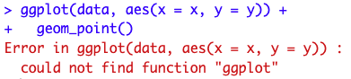
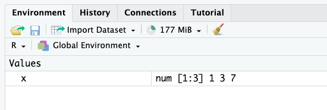
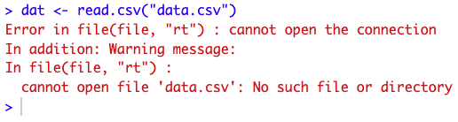
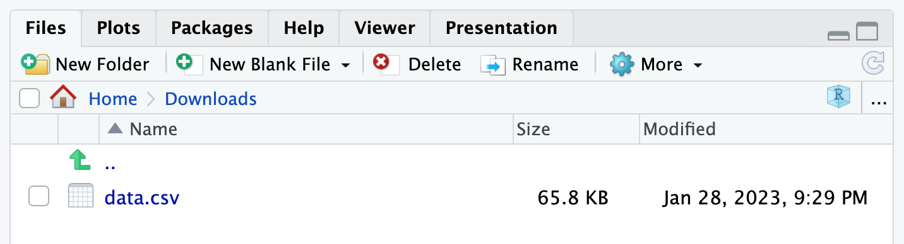

```{r setup, include=FALSE}
knitr::opts_chunk$set(
  fig.align = "center",
  out.width = "100%",
  tidy = "styler"
  # warning = FALSE,
  # message = FALSE
)

set.seed(42)
```

{width=100%}

# Introduction

If you are just starting with R, you will often encounter errors in your code which prevent it to run. I remember when I was just starting to use R, errors in my code were so frequent that I almost gave up learning this programming language. I even recall that I went back to Excel a few times to finish my analyses because I could not find what was causing the issue.

Fortunately, I forced myself to continue despite the difficulties of the beginning. And today, even if I still encounter errors almost every time I write R code, with experience and practice, it takes less and less time to fix them. If you are also struggling at the beginning, rest assured, it is normal: everyone experiences some frustration when learning a new programming language (and this is the case not only with R).

In this post, I highlight the **10 most common errors in R and how to fix them**. Of course, errors depend on your code and your analyses, so it is impossible to cover all of them (and Google does it way better than me). However, I would like to focus on some common syntax mistakes that are frequent when learning R, and which can sometimes take a long time to be fixed before realizing that the solution is right in front of our eyes.

This collection is based on my personal experience and the errors encountered by my students when I [teach](https://antoinesoetewey.com/teaching/) R. This list being non-exhaustive, feel free to comment (at the end of the post) with errors you often face when using R.

For each error, I provide examples and solutions to fix them. I also mention a couple of warnings (which are, strictly speaking, not errors) at the end of the post.

# 1. Unmatched parentheses, curly braces, square brackets or quotes

One rather trivial but still quite frequent error is a missing parenthesis, curly brace, square bracket or quotation mark.

This type of error is applicable to many programming languages. In R, for instance:

```{r, eval = FALSE}
## missing a closing parenthesis:
mean(c(1, 7, 13)
     
## missing a curly brace before "else":
x <- 7 
if(x > 10) {
  print("x > 10")
 else {
  print("x <= 10")
 }
  
## missing a square bracket:
summary(ggplot2::diamonds[, "price")

## missing a closing quote in 2nd element:
grp <- c("Group 1", "Group 2) 
grp
```

These errors are easy to detect when the code is basic, but can become much harder to spot with a more complex code, for instance:^[There are 2 mistakes in that piece of code, feel free to try to fix them as an exercise.]

```{r, eval = FALSE}
for (i in y) {
  for (j in x) {
    p <- ggboxplot(dat,
      x = colnames(dat[j]), y = colnames(dat[i]),
      color = colnames(dat[j]),
      legend = "none",
      palette = "npg",
      add = "jitter"
    )
    print(
      p + stat_compare_means(aes(label = paste0(..method.., ", p-value = ", ..p.format..),
        method = method1, label.y = max(dat[, i], na.rm = TRUE)
      )
      + stat_compare_means(comparisons = my_comparisons, method = method2, label = "p.format")
    )
  }
```

Thankfully, if you use RStudio,^[And I strongly recommend using RStudio and not just R. See the differences [here](/blog/how-to-install-r-and-rstudio/).] a closing parenthesis, curly brace, square bracket or quotation mark will automatically be written when you open one.

Bear in mind that when installing a package, you *must* use (single or double) quotation marks around the package's name:

```{r, eval = FALSE}
## NOT correct:
install.packages(ggplot2)
```

```{r}
## Error in install.packages : object 'ggplot2' not found
```

```{r, eval = FALSE}
## correct:
install.packages("ggplot2")

## also correct:
install.packages('ggplot2')
```

### Solution

The solution of course is to simply match all opening parentheses, curly braces, square brackets and quotation marks with their closing counterparts:

```{r}
mean(c(1, 7, 13))

x <- 7     
if(x > 10) {
  print("x > 10")
 } else {
  print("x <= 10")
 }

summary(ggplot2::diamonds[, "price"])

grp <- c("Group 1", "Group 2") 
grp
```

Also, make sure:

- to correctly place commas:

```{r, eval = FALSE}
## NOT correct (misplaced comma):
c("Group 1," "Group 2")
```

```{r}
## Error: unexpected string constant in "c("Group 1," "Group 2""
```

```{r, eval = FALSE}
## also NOT correct (missing comma):
c("Group 1" "Group 2")
```

```{r}
## Error: unexpected string constant in "c("Group 1" "Group 2""
```

```{r, eval = FALSE}
## correct:
c("Group 1", "Group 2")
```

- you do not mix single and double quotation marks for the same element:

```{r, eval = FALSE}
## NOT correct:
c("Group 1')

## correct:
c("Group 1")

## also correct:
c('Group 1')
```

Note that `c('Group 1', "Group 2")` does not throw an error but for consistency, it is not recommended to mix single and double quotes within the same vector.

# 2. Using a function that is not installed or loaded

If you encounter the following error: "Error in ... : could not find function '...'", for example:

{width=100%}

it means you are trying to use a function belonging to a package which is not yet installed or loaded.

### Solution

To solve this error, you have to install the package (if it is not installed yet) and load it with the `install.packages()` and `library()` functions, respectively:

```{r, eval = FALSE}
## install package:
install.packages("ggplot2")

## load package:
library(ggplot2)
```

If you are not sure about the usage of these two functions, see more details about [installing and loading a package in R](/blog/an-efficient-way-to-install-and-load-r-packages/).

# 3. Typos in function, variable, dataset, object or package names

Another common mistake is to misspell a function, a variable, a dataset, an object or a package's name, for example:

```{r, eval = FALSE}
## typo in function name:
maen(c(1, 7, 13))
```

```{r}
## Error in maen(c(1, 7, 13)) : could not find function "maen"
```

```{r, eval = FALSE}
## typo in variable name:
summary(ggplot2::diamonds[, "detph"])
```

```{r}
## Error: Column `detph` doesn't exist
```

```{r, eval = FALSE}
## typo in dataset name:
data <- data.frame(x = rnorm(10),
                   y = rnorm(10))
summary(dta[, 2])
```

```{r}
## Error in summary(dta[, 2]) : object 'dta' not found
```

```{r, eval = FALSE}
## typo in object name:
test <- c(1, 7, 13)
mean(tset)
```

```{r}
## Error in mean(tset) : object 'tset' not found
```

```{r, eval = FALSE}
## typo in package name:
library("tydiverse")
```

```{r}
## Error in library("tydiverse") : there is no package called ‘tydiverse’
```

### Solution

Make sure that you correctly spell all your functions, variables, datasets, objects and packages:

Note that **R is case sensitive**; `mean()` is considered different than `Mean()` for R!

```{r}
mean(c(1, 7, 13))

summary(ggplot2::diamonds[, "depth"])

data <- data.frame(x = rnorm(10),
                   y = rnorm(10))
data[, 2]

test <- c(1, 7, 13)
mean(test)

library(tidyverse)
```

If you are sure that you correctly spelled an object, a function or a dataset but you still have an error stating that "object '...' is not found", make sure that you defined your object/function/dataset *before* calling it!

It often happens that a student asks me to come to his/her computer because he/she runs the exact same code than me, but cannot make it work. Most of the time, if his/her code is indeed exactly the same than mine, he/she simply has not executed a object/function/dataset before running the code which includes that object/function/dataset. In other words, he/she simply tries to use an undefined object or variable.

Remember that writing code in a R script (contrarily to the console) does not mean it is compiled. You actually have to run it (by clicking on the Run button or using the keyboard shortcut) in order the code to be executed and used later. If you are still struggling with this, see the [basics of R and RStudio](/blog/how-to-install-r-and-rstudio/).

# 4. Missing, incorrect or misspelled arguments in functions

Most R functions require arguments. For example, the `rnorm()` function requires at least the number of observations, specified via the argument `n`.

Your code will not run if you do not specify compulsory arguments, or if incorrectly specify an argument. Moreover, the result might not be what you expect if you misspell an argument:

```{r, eval = FALSE}
## missing compulsory argument:
rnorm()
```

```{r}
## Error in rnorm() : argument "n" is missing, with no default
```

```{r, eval = FALSE}
## incorrect argument:
rnorm(n = 3, var = 1)
```

```{r}
## Error in rnorm(n = 3, var = 1) : unused argument (var = 1)
```

```{r, eval = TRUE}
## misspelled argument:
mean(c(1, 7, 13, NA), narm = TRUE)
```

The last piece of code does not throw an error, but the result is not what we want.

### Solution

To solve these errors, make sure to specify **at least all compulsory arguments** of the function, and the correct ones:

- In `rnorm()`, it is the standard deviation, `sd`, which can be specified in addition to the number of observations `n` (instead of the variance `var`).
- Removing `NA` is done with `na.rm` (instead of `narm`).

```{r}
rnorm(n = 3, sd = 1)

mean(c(1, 7, 13, NA), na.rm = TRUE)
```

If you do not know the arguments of a function by heart, you can always check the documentation with `?function_name` or `help(function_name)`, for example:

```{r, eval = FALSE}
?rnorm()

## or:
help(rnorm)
```

# 5. Wrong, inappropriate or inconsistent data types

There are several [data types in R](/blog/data-types-in-r/), the main ones being:

- Numeric
- Character
- Factor
- Logical

You know that some operations and analyses are possible and appropriate only with some specific types of data.

For example, it is not appropriate to compute the [mean](/blog/descriptive-statistics-in-r/#mean) of a factor or character variable:

```{r}
gender <- factor(c("female", "female", "male", "female", "male"))

mean(gender)
```

Likewise, although it is technically possible, it makes little sense to draw a [barplot](/blog/descriptive-statistics-in-r/#barplot) of a [quantitative continuous](/blog/variable-types-and-examples/) variable because in most cases, the frequency will be 1 for each value:

```{r}
barplot(table(rnorm(10)))
```

*(By the way, if your data is not already displayed in the form of a table, do not forget to add `table()` inside the `barplot()` function.)*

### Solution

Make sure to use the appropriate operation and type of analysis depending on the variable(s) of interest.

For example:

- for factor variables, it is more appropriate to compute frequencies and/or relative frequencies, and draw barplots
- for quantitative continuous variables, it is more appropriate to compute the mean, median, etc. and draw histograms, boxplots, etc.
- for logical variables, the mean,^[Note that `mean()` applied to a logical variable gives the proportion of `TRUE`.] a frequency table and a barplot are appropriate
- for character variables, [word clouds](/blog/draw-a-word-cloud-with-a-shiny-app/) are the most appropriate (unless the variable can be considered as a factor variable because there are not too many different levels)

We now illustrate the examples in R:^[`par(mfrow = c(1, 2))` is used to put two plots next to each other.]

```{r}
## factor:
table(gender)
prop.table(table(gender))
barplot(table(gender))

## quantitative continuous:
x <- rnorm(100)

summary(x)
par(mfrow = c(1, 2)) ## combine two plots
hist(x)
boxplot(x)
```

```{r}
## logical:
x <- c(TRUE, FALSE, FALSE, TRUE, TRUE)

mean(x)
table(x)
barplot(table(x))
```

For the interested reader, see the most common [descriptive statistics in R](/blog/descriptive-statistics-in-r/) for different types of data.

Note that, as for descriptive statistics, the choice of the statistical test depends on the variable's type. See this [flowchart](/blog/what-statistical-test-should-i-do/) to help you in selecting the most appropriate statistical test depending on the number of variables and their types.

An error linked to the one mentioned above is **inconsistent** data type. See it in practice with the following example:

```{r}
x <- c(2.4, 3.7, 5.1, 9.8)
class(x)

y <- c(2.4, 3.7, 5.1, "9.8")
class(y)
```

As you can see, vector `x` is numerical, whereas vector `y` is in the form of character. This is due to the fact that the last element of `y` is surrounded with quotation marks (and thus considered as a string instead of a numerical value), so the entire vector takes the character form.

This can happen when you [import a dataset into R](/blog/how-to-import-an-excel-file-in-rstudio/) and one or several elements of a variable are not encoded correctly. This leads to the entire variable to be considered as a character variable by R.

To avoid this, it is a good practice to check the structure of your dataset (with `str()`) after importing it to make sure all your variables have the desired format. If not, you can either correct the values in the initial file or change the format in R (with `as.numeric()`).

# 6. Forgetting the + sign in ggplot2

If you just learned to use the [ggplot2 package](/blog/graphics-in-r-with-ggplot2/) for your visualizations (and I highly recommend it!), a common mistake is to forget the `+` sign.

You know that a visualization made with ggplot2 is constructed by adding several layers:

```{r}
## load package:
library(ggplot2)

## first layer, the dataset:
ggplot(data = diamonds) +
  ## second layer, the aesthetics:
  aes(x = cut, y = price) +
  ## third layer, the type of plot:
  geom_boxplot() +
  ## add more layers:
  theme_minimal()
```

### Solution

For all your graphics with ggplot2, do not forget to add a **`+` sign after each layer *except* the last one**.

# 7. Misunderstanding between = and ==

Assignment in R can be done in three ways, from the most to the least common:

1. `<-`
1. `=`
1. `assign()`

The second method, that is `=`, should not be confused with `==`.

Indeed, assigning an object (with any of the three above methods) is used to save something in R. For example, if we want to save the vector `(1, 3, 7)` and rename that vector `x`, we can write:

```{r, tidy = FALSE}
x <- c(1, 3, 7)

## or:
x = c(1, 3, 7)

## or:
assign("x", c(1, 3, 7))
```

When executing this piece of code, you will see that the vector `x` of size 3 appears in the tab "Environment" (the top right panel if you use the default view of RStudio):

{width=100%}

From now on, we can use that vector simply by calling it by its name:

```{r}
x
```

By no means, you can assign an object with `==`:

```{r, eval = FALSE}
## NOT correct if we want to assign c(1, 3, 7) to x:
x == c(1, 3, 7)
```

So you are wondering, when would we need to use `==`? Actually, it is used when you want to use an equal sign.

I understand that it may be abstract and confusing at the moment, so let's suppose the following two scenarios as examples (which are the two most common cases when we use `==`):

1. we want to check whether an assigned object or variable respects some conditions, and
1. we want to subset a dataframe based on one or several conditions.

For these examples, suppose a [sample](/blog/what-is-the-difference-between-population-and-sample/) of 5 children:

```{r}
## create dataframe:
dat <- data.frame(Name = c("Mary", "Linda", "James", "John", "Patricia"),
                  Age = c(7, 10, 3, 9, 7),
                  Gender = c("Girl", "Girl", "Boy", "Boy", "Girl"))

## print dataframe:
dat
```

Let's now write different pieces of code for these two scenarios to illustrate them:

- We want to check whether the variable `Age` is equal to the vector `(1, 2, 3, 4, 5)`:

```{r}
dat$Age == 1:5
```

With this code, we ask whether the first element of the variable `Age` is equal to 1, the second element of the variable `Age` is equal to 2, and so on. The answer is of course `FALSE`, `FALSE`, `TRUE`, `FALSE` and `FALSE` since only the third child has an age **equal** to 3 years.

- We want to know which of our 5 sampled children are girls:

```{r}
dat$Gender == "Girl"
```

The results show that the first, second and fifth children are girls, while the third and fourth children are not girls.

If you write any of these two lines:

```{r, eval = FALSE, tidy = FALSE}
## this overwrites Age and Gender:
dat$Age = 1:5
dat$Gender = "Girl"
```

You actually overwrite the `Age` and `Gender` variables, such that our 5 children will have an age from 1 to 5 (1 year for the first child, up to 5 years for the fifth child) and all of them will be girls.

- Now suppose we want to subset our dataframe based on a condition, namely, we want to extract only the children who are 7 years old:

```{r}
subset(dat, Age == 7)
```

If you do not want to use the subset function, you can also use square brackets:

```{r}
dat[dat$Age == 7, ]
```

As you can see in the previous examples, we do not want to assign anything. Instead, we are asking "is this variable or vector *equal* to something else?". For that specific need, we use `==`.

So to sum up, for technical reasons and in order to distinguish between the two concepts, R uses `=` for assignments, and `==` for the equality sign. Make sure to understand the difference between the two to avoid any errors.

# 8. Undefined columns selected

If you are used to subset dataframes with square brackets, `[]`, instead of the `subset()` or `filter()` functions, you may have faced the error "Error in [.data.frame(...) : undefined columns selected".

This occurs when R does not understand the column you want to use while subsetting the dataset.

Considering the same sample of 5 children introduced earlier, the following code will throw an error:

```{r, eval = FALSE}
dat[dat$Age == 7]
```

```{r}
## Error in `[.data.frame`(dat, dat$Age == 7) : undefined columns selected
```

because it does not specify the column dimension.

### Solution

Remember that dataframes in R have two dimensions:

1. the rows (one for each experimental unit), and
1. the columns (one for each variable)

and **in that particular order** (so row first, then column)!

Since dataframes have two dimensions, R expects two dimensions when you call `dat[]`.

In particular, it expects the first and then the second dimension, **separated by a comma**:

```{r}
dat[dat$Age == 7, ]
```

This code means that we are extracting all rows where `Age` is equal to 7 (first dimension, i.e. before the comma), for all variables of the dataset (since we did not specify any column after the comma).

For the interested reader, see more ways to [subset and manipulate data in R](/blog/data-manipulation-in-r/).

# 9. Problem when importing or using the wrong data file

Importing a dataset in R can be quite challenging for beginners, mainly due to the misunderstanding about the working directory.

When importing a file, **R will not search for the file in all your folders** of your computer. Instead, it will look only in one specific folder. If your dataset is not inside that folder, it will result in an error such as "cannot open file '...': No such file or directory":

{width=100%}

To fix this, you must specify the path to the folder where your dataset is located. In other words, you need to tell R in which folder you want it to work, hence the name working directory.

Setting the working directory can be done with the `setwd()` function or via the "Files" tab in the lower right panel of RStudio:

{width=100%}

Alternatively, you can move the dataset in the folder where R is currently working (this can be found with `getwd()`). See more details on [importing a file into R and about the working directory](/blog/how-to-import-an-excel-file-in-rstudio/).

Another related problem is to use the wrong file. This error is different than the previous ones in the sense that you will not encounter an error but your analyses will still be wrong.

It may sound trivial, but make sure to import and use the correct data file! This is particularly the case if you have files for different points in time and which have a common structure (for example weekly or monthly data files with the exact same variables). It happened to me that I reported results for the wrong week (fortunately, without much consequence).

Also, make sure that you actually use all the rows you want to include in your analyses. It happened to me that, in order to test a model (and avoid long computing times), I extracted a random sample of the original dataset, and almost forgot about this sampling when running my final analyses.

It is thus a good practice to remind you to remove sampling and filters after you have tested your code (and before interpreting the final results).

# 10. Problem when using the $ operator

For the last error of this top 10, I would like to focus on two related errors:

1. "$ operator is invalid for atomic vectors", and
1. "object of type 'closure' is not subsettable".

I gather them in one single section because they are linked to each other in the sense that they both involve the `$` operator.

## $ operator is invalid for atomic vectors

To understand this error, we first must recall that an atomic vector is a *one*-dimensional object (usually created with `c()`). This is different than dataframes or matrices which are *two*-dimensional (i.e., rows form the first dimension and columns correspond to the second dimension).

The error "\$ operator is invalid for atomic vectors" occurs when we try to access an element of an atomic vector using the dollar operator (`$`):

```{r}
## define atomic vector:
x <- c(1, 3, 7)

## set names:
names(x) <- LETTERS[1:3]

## print vector:
x
```

```{r, eval = FALSE}
## access value of element C:
x$C
```

```{r}
## Error in x$C : $ operator is invalid for atomic vectors
```

### Solution

The `$` operator cannot be used to extract elements in atomic vectors. Instead, we must use double brackets `[[]]` notation:

```{r}
x[["C"]]
```

Remember that the `$` operator can be used with dataframes, so we can also fix this error by first converting the atomic vector to a dataframe,^[Note that we also need to take the transpose of the vector `x` in order to have it as 1 row, 3 columns.] and then access an element by its name with the `$` operator:

```{r}
## convert atomic vector to dataframe:
x <- as.data.frame(t(x))

## print x:
x

## access value of element C:
x$C
```

## object of type 'closure' is not subsettable

Another error (which I must admit is quite obscure and confusing when learning R) is the following: "object of type 'closure' is not subsettable".

This error occurs when we try to subset or access some elements of a function. An example with the well-known `mean()` function:

```{r, eval = FALSE}
mean[1:3]
```

```{r}
## Error in mean[1:3] : object of type 'closure' is not subsettable
```

In R, we can subset lists, vectors, matrices, dataframes, but not functions. So it throws an error because it is impossible to subset an object of type "closure", and a function is of that type:

```{r}
typeof(mean)
```

Most of the times, you will not encounter this error when using a basic function such as the `mean()` function (because it is unlikely that your goal is really to subset a function...).

Indeed, you will most likely face this error when trying to subset a dataset named `data`, but this dataset is not defined in the environment (because it has not been imported or created properly for instance).

To understand the concept, see the following examples:

```{r}
## create dataset:
data <- data.frame(x = rnorm(10),
                   y = rnorm(10))

## print variable x:
data$x
```

So far so good. Now suppose we made a mistake when creating the dataset:

```{r, echo = FALSE}
rm(data)
```

```{r, eval = FALSE}
## create dataset (with mistake):
data <- data.frame(x = rnorm(10)
                   y = rnorm(10))
```

You will notice that a comma is missing between variables `x` and `y`. As a result, the dataset named `data` is not created and thus not defined.

Therefore, if we now try to access the variable `x` from that dataset `data`, R will actually try to subset the function named `data` instead of the dataset named `data`!

```{r, eval = FALSE}
data$x
```

```{r}
## Error in data$x : object of type 'closure' is not subsettable
```

This happens because, I repeat, the dataset `data` does not exist, so R looks for an object named `data` and find a function with that name:

```{r}
class(data)
```

# Warnings

Warnings are different than errors in the sense that they alert you about something, but it does not prevent you from running the code. It is a good practice to read these warnings as they may give you valuable information.

There are too many warnings to mention them all, but I would like to focus on two common ones:

1. "NAs introduced by coercion", and
2. "Removed ... rows containing non-finite values (stat_bin())".

## NAs introduced by coercion

This warning occurs when you try to convert a vector which includes at least one non-numerical value to a numeric vector:

```{r}
x <- c(1, 3, 7, "Emma")

as.numeric(x)
```

You do not need to fix it since it is only a warning and not an error. R is simply informing you that at least one element in the initial vector was converted to `NA` because it could not be converted to a numeric value.

## Removed ... rows containing non-finite values (stat_bin())

This warning occurs when you use [ggplot2](/blog/graphics-in-r-with-ggplot2/) to draw plots. For instance:

```{r}
ggplot(airquality) +
  aes(x = Ozone) +
  geom_histogram()
```

Again, as it is a warning you do not need to fix it. It is simply informing you that there are some missing values (`NA`) in the variable of interest and that these missing values are removed to construct the plot.

Thanks for reading. I hope that this collection of errors prevented you from making some coding mistakes, or that it helped you in debugging your code.

If you still cannot fix your error, I would recommend to read the documentation of the function (if you struggle with a function in particular), or look online for the solution. Bear in mind that if you encounter an error, it is very likely that someone else posted the answer online (Stack Overflow is usually a good resource).

R has a steep learning curve, in particular if you are not familiar with another programming language. Nonetheless, with practice and time, you will make less and less coding errors, but more importantly, you will be more and more proficient in typing the right keywords in search engines, resulting in less time spent looking for the solution.

As always, if you have a question or a suggestion related to the topic covered in this article, please add it as a comment so other readers can benefit from the discussion.
