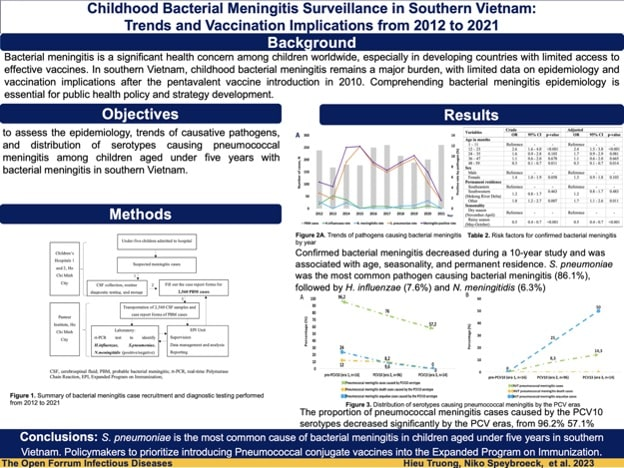

```{r setup, include=FALSE}
knitr::opts_chunk$set(
  fig.align = "center",
  out.width = "100%",
  tidy = "styler",
  warning = FALSE,
  message = FALSE
)

set.seed(42)
```

{width=100%}

I am happy to announce that a paper I contributed to has been accepted for publication in Open Forum Infectious Diseases [@truong2023childhood].

This study investigates bacterial meningitis among children aged under five years in Southern Vietnam for the last 10 years.

**Read more [here](https://doi.org/10.1093/ofid/ofad229).**

I hope this paper will, to some extent, be helpful for your research.

As always, if you have any question related to the topic covered in this paper, please add it as a comment so other readers can benefit from the discussion.

## References
