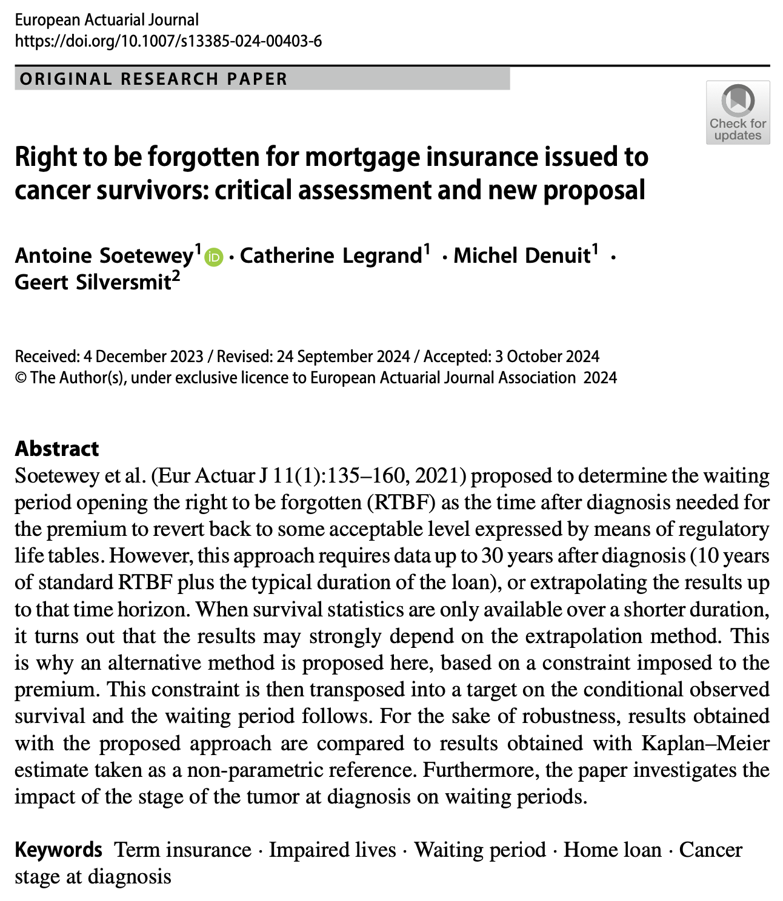

```{r setup, include=FALSE}
knitr::opts_chunk$set(
  fig.align = "center",
  out.width = "100%",
  tidy = "styler",
  warning = FALSE,
  message = FALSE
)

set.seed(42)
```

{width=100%}

I am happy to announce that our paper entitled "Right to be forgotten for mortgage insurance issued to cancer survivors: critical assessment and new proposal" has been accepted for publication in *European Actuarial Journal*.

In this paper, we propose an alternative method to determine the waiting period opening the right to be forgotten in insurance. This new method is based on a constraint imposed to the premium, which is then transposed into a target on the conditional observed survival. Furthermore, the paper also investigates the impact of the stage of the tumor at diagnosis on waiting periods.

**Read more [here](http://dx.doi.org/10.1007/s13385-024-00403-6).**

Thanks to all co-authors for the great work. We are also thankful to the two anonymous reviewers for their input that has greatly helped shape the paper.

As always, if you have any question related to the topic covered in this paper, please add it as a comment so other readers can benefit from the discussion.
