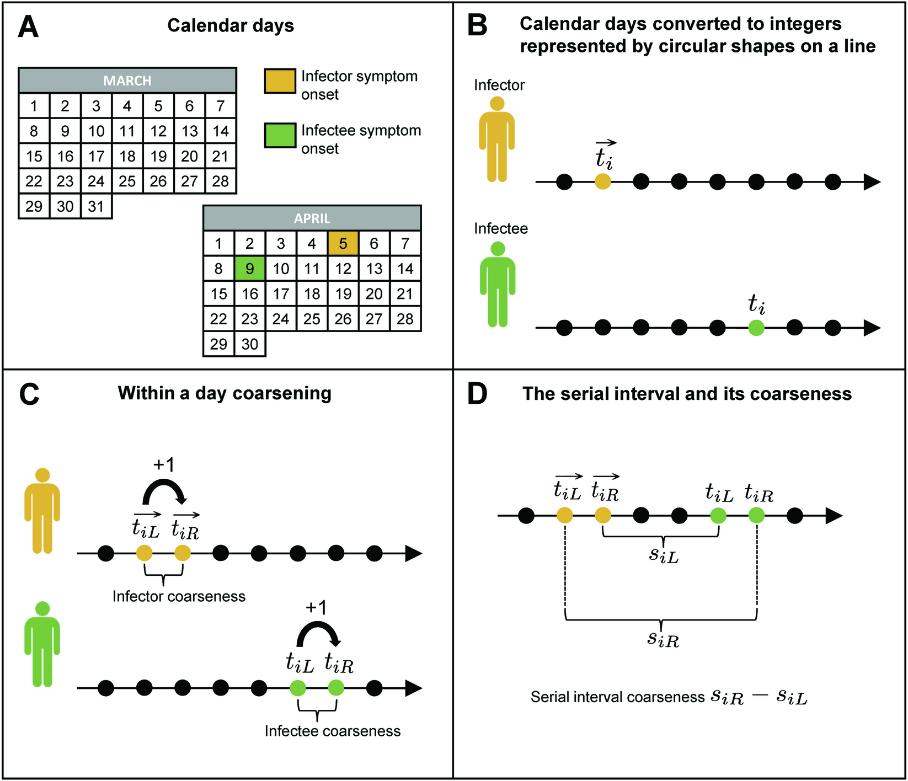

```{r setup, include=FALSE}
knitr::opts_chunk$set(
  fig.align = "center",
  out.width = "100%",
  tidy = "styler",
  warning = FALSE,
  message = FALSE
)

require("EpiDelays")
```

## Motivation

Epidemiological delays inform about the time between two well-defined events related to a disease. The serial interval (SI) of an infectious disease is defined as the time between symptom onset in a primary case (infector) and symptom onset in a secondary case (infectee). It is a widely used epidemiological delay quantity and plays a central role in mathematical/statistical models of disease transmission. There exists a tight link between the reproduction number (average number of secondary infections generated by an infected individual) and the serial interval. Therefore, getting accurate knowledge about the SI distribution is key to gain a clear understanding of transmission dynamics during outbreaks. Timings of symptom onset for infector-infectee pairs can be obtained from line list data and observations usually consist of calendar dates. From a mathematical perspective, it is more convenient to work with numbers than with calendar dates and the latter are typically transformed to integers for the sake of statistical analysis.

The main challenge when working with SI data is censoring in the sense that exact symptom onset times are usually unobserved and only known to have occurred between two time points. If the time resolution of a reported timing of illness onset is a calendar day, for instance July 15, there is not enough information to determine the exact time of illness onset within that day. As such, symptom onset is assumed to have occurred between July 15 and July 16 and we say that serial interval data are interval-censored. The figure below illustrates the coarse structure of SI data that adds a layer of complexity to the estimation problem.

{width=100%}

<br>

A recent article by [Gressani and Hens (2025)](https://doi.org/10.1371/journal.pcbi.1013338) published in PLOS Computational Biology proposes a new estimator of the cumulative distribution function of the serial interval without making parametric assumptions regarding the underlying SI distribution. The estimator is based on mixtures of uniform distributions and only requires left and right bounds of serial interval windows of infector-infectee pairs as a main input ($s_{iL}$ and $s_{iR}$ in the above figure). Point estimates of different serial interval features are available in closed-form and the bootstrap is used to compute confidence intervals. The nonparametric methodology is relatively simple and computationally fast and stable. Moreover, a user-friendly routine is available in the [EpiDelays package](https://github.com/oswaldogressani/EpiDelays) written in R. This post aims at giving  users a simple first experience with this new nonparametric methodology for serial interval estimation. The package can be installed from GitHub (using devtools) as follows:

```{r installEpiDelays, eval=FALSE}
install.packages("devtools")
devtools::install_github("oswaldogressani/EpiDelays")
```

## Simulated data

The `estimSI()` routine of the EpiDelays package can be used to compute nonparametric estimates (point estimates with standard errors and confidence intervals) of different serial interval features (e.g. the mean, median, standard deviation). The routine is simple to use and requires only two inputs:

- `x`: A data frame with $n$ rows (corresponding to the number of transmission pairs for which illness onset data is available) and two columns containing the lower bound of the SI window $s_{iL}$ (first column) and the upper bound of the SI window $s_{iR}$ (second column). 

- `nboot`: An integer for the bootstrap sample size (default is 2000) used to construct ($90\%$ and $95\%$) confidence intervals (CIs).

We start by illustrating the use of `estimSI()` on simulated data. The `simSI()` routine can be used to simulate artificial serial interval data with SI windows having a width (coarseness) of at least two days. The underlying target SI distribution is assumed to have a Gaussian distribution with mean `muS` and standard deviation `sdS` that have to be specified by the user. The code below can be used to generate $n=15$ SI windows from a Gaussian distribution with a mean of $3$ days and standard deviation of $2$ days. More details regarding the data generating mechanism can be found in the [article](https://doi.org/10.1371/journal.pcbi.1013338).

```{r simSIdata}
set.seed(2025)
simdata <- simSI(muS = 3, sdS = 2, n = 15)
gt::gt(round(simdata,2))
```

<br>

The first column of the simulated dataset contains the true (unobserved) serial interval value generated from the chosen Gaussian distribution. The second and third columns contain the left and right bound of the SI window (`sl` and `sr`). Finally, the last column contains the width of the observed SI window, i.e. `sw=sr-sl`. The underlying target SI distribution is specified to be Gaussian with a mean of $3$ days and standard deviation of $2$ days. The 5th, 25th, 75th and 95th quantiles of the latter distribution are:

```{r tarquantiles}
round(qnorm(p = c(0.05,0.25,0.75,0.95), mean = 3, sd = 2), 1)
```

We now create a data frame containing `sl` and `sr` and use the latter as an input in the `estimSI()` routine. Nonparametric estimates of different SI features can be accessed with `$npestim$`.

```{r estimSIroutine}
xdf <- data.frame(sl = simdata$sl, sr = simdata$sr)
SIfit <- estimSI(x = xdf, nboot = 2000)
gt::gt(round(SIfit$npestim, 1),
       rownames_to_stub = TRUE)
```

<br>

The output shows point estimates (point), standard errors (se) and confidence intervals bounds (ci) for the serial interval mean, standard deviation (sd) and 5th, 25th, 50th, 75th and 95th quantiles denoted by q0.05, q0.25, etc. We can also plot the estimated cumulative distribution function (cdf) obtained with the nonparametric approach and compare it with the target Gaussian cdf. The quality of the fit will typically depend on the sample size $n$ and on the degree of coarseness present in the data. Note that the nonparametric methodology naturally deals with negative SI values.

```{r comparecdfs, fig.align='center'}
sl <- simdata$sl
sr <- simdata$sr
Fhat <- function(s) (1 / SIfit$n) * sum((s - sl) / (sr - sl) * (s >= sl & s <= sr) + (s > sr))
sf   <- seq(-3, 8, length = 100)
plot(sf, sapply(sf, Fhat), type = "l", lwd = 2, xlab = "Serial interval", ylab = "cdf")
grid()
lines(sf, pnorm(sf, mean = 3, sd = 2), col = "blue", lwd = 2)
legend("topleft", c("Estimated cdf of SI", "Target cdf of SI"), col = c("black", "blue"), lwd = c(2,2), bty = "n")
```

## Real data

[Lessler et al. (2009)](https://www.nejm.org/doi/full/10.1056/NEJMoa0906089) share a dataset containing serial interval windows obtained from $n=16$ infector-infectee pairs for Influenza A (2009 H1N1 influenza) at a New York City school. The SI windows are directly available from the supplementary appendix of the latter reference and are encoded in a data frame `xNY`. Nonparametric estimates of serial interval features are then obtained with `estimSI()`.

```{r realdat}
xNY <- data.frame(sl = c(1,1,1,0,0,4,2,3,0,3,0,3,4,1,3,3), sr = c(3,3,3,2,2,6,4,5,2,5,2,5,6,3,5,5))
set.seed(123)
SIfitNY <- estimSI(xNY, nboot = 2000)
gt::gt(round(SIfitNY$npestim, 1),
       rownames_to_stub = TRUE)
```

<br>

Interested readers can find more real data examples in [Gressani and Hens (2025)](https://doi.org/10.1371/journal.pcbi.1013338) and learn about the strengths and limitations of this new nonparametric methodology for serial interval estimation.

### References

Gressani, O. and Hens, N. (2025). Nonparametric serial interval estimation with uniform mixtures.
*PLoS Computational Biology* **21**(8):e101338. <https://doi.org/10.1371/journal.pcbi.1013338>

Gressani; O. (2025). EpiDelays: A Software for Estimation of Epidemiological Delays (version 0.0.1). <https://github.com/oswaldogressani/EpiDelays>


Lessler, J., Reich, N. G., Cummings, D. A., and the New York City Department of Health and Mental Hygiene Swine Influenza Investigation Team. (2009). Outbreak of 2009 pandemic influenza A (H1N1) at a New York City school. *New England Journal of Medicine* **361**(27), 2628-2636. <https://www.nejm.org/doi/full/10.1056/NEJMoa0906089>
