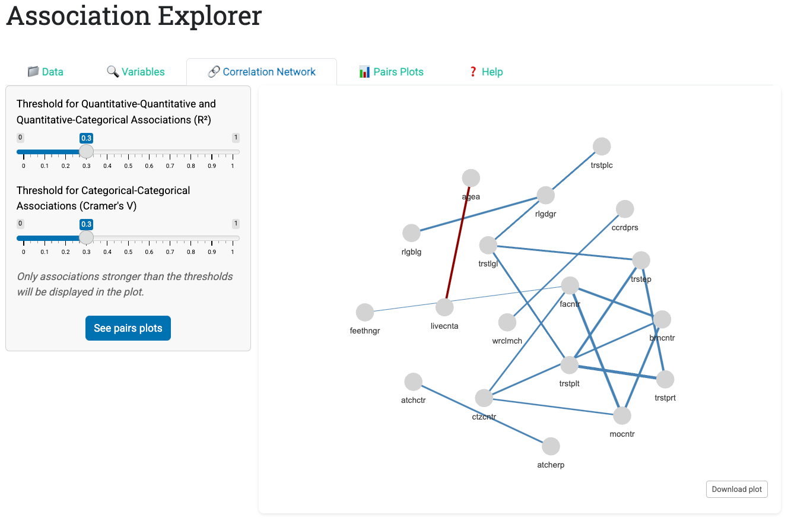

```{r setup, include=FALSE}
knitr::opts_chunk$set(
  fig.align = "center",
  out.width = "100%",
  tidy = "styler",
  warning = FALSE,
  message = FALSE
)

set.seed(42)
```

{width=100%}

I am pleased to announce the publication of our paper "AssociationExplorer: A user-friendly Shiny application for exploring associations and visual patterns" in the journal *SoftwareX*, together with the official release of the AssociationExplorer2 R package on CRAN.

Both the paper and the software are part of an open-science effort aimed at making exploratory data analysis more accessible to non-technical users.

## Why AssociationExplorer?

Exploring multivariate datasets is now central in social sciences, data journalism, and education. However, identifying and interpreting associations between variables often requires programming skills and a solid background in statistics, which can represent a substantial barrier for many users.

AssociationExplorer was designed to lower this barrier by providing an interactive, visual, and statistically grounded tool for exploring associations between quantitative and qualitative variables, without requiring users to write any code.

The application is primarily intended for:

- journalists and data journalism practitioners,
- teachers and students,
- researchers in the exploratory phase of an analysis,
- engaged citizens interested in understanding public or survey data.

## What does the app do?

AssociationExplorer follows a simple and guided workflow:

- Import data (CSV or Excel files)
- Interactively select variables of interest
- Automatically compute association measures adapted to variable types:
  - Pearson’s $r$ correlation for numeric–numeric pairs,
  - Cramer’s V for categorical–categorical pairs,
  - the correlation ratio $\eta$ for mixed numeric–categorical pairs
- Filter associations using user-defined thresholds
- Visualize results through:
  - an interactive correlation network,
  - contextual bivariate visualizations (scatter plots, mean plots, and colored contingency tables)

This workflow is designed to support transparent, reactive, and interpretable exploratory data analysis.

## A paper published in *SoftwareX*

The *SoftwareX* paper provides a detailed description of:

- the motivation and intended audience of the tool,
- the software architecture,
- the methodological choices underlying the association measures,
- an illustrative case study based on the European Social Survey,
- and perspectives for future development.

Link to the paper: <https://doi.org/10.1016/j.softx.2025.102483>

In line with the journal’s standards, the code, documentation, and example data are fully open and reproducible.

## The R package is also on CRAN

Alongside the paper, a R package is also available on CRAN, making installation and use straightforward:

```r
install.packages("AssociationExplorer2")
library(AssociationExplorer2)
run_associationexplorer()
```

The CRAN release ensures:

- standardized installation,
- better integration with existing R workflows,
- clearer versioning and dependency management.

## Who is it for, and how can it be used?

AssociationExplorer is particularly useful for:

- exploratory analysis prior to formal modeling,
- teaching concepts related to association and dependence,
- data storytelling and journalistic exploration,
- the analysis of survey data and public datasets.

The goal is not to replace confirmatory statistical analyses, but to provide a robust tool for understanding the structure of the data before modeling.

## Acknowledgements

This work was carried out in collaboration with Cédric Heuchenne, Arnaud Claes, and Antonin Descampe, whom I warmly thank.

The project is supported by the Walloon Region and SPW Recherche within the ODALON research project.

## Useful links

- 📄 *SoftwareX* paper: <https://doi.org/10.1016/j.softx.2025.102483>  
- 📦 CRAN package: <https://CRAN.R-project.org/package=AssociationExplorer2>  
- 💻 GitHub repository:
  + of the [paper](https://github.com/AntoineSoetewey/AssociationExplorer)
  + of the [R package](https://github.com/AntoineSoetewey/AssociationExplorer2)

As always, feedback, bug reports, and suggestions are very welcome.

Thanks for reading!

## References

Soetewey, A., Heuchenne, C., Claes, A. and Descampe, A. (2026). AssociationExplorer: A user-friendly shiny application for exploring associations and visual patterns. *SoftwareX, 33*(102483). https://doi.org/10.1016/j.softx.2025.102483

Soetewey, A., Heuchenne, C., Claes, A. and Descampe, A. (2025). AssociationExplorer2: A User-Friendly 'shiny' Application for Exploring Associations and Visual Patterns. R package version 0.1.4, https://github.com/AntoineSoetewey/AssociationExplorer2