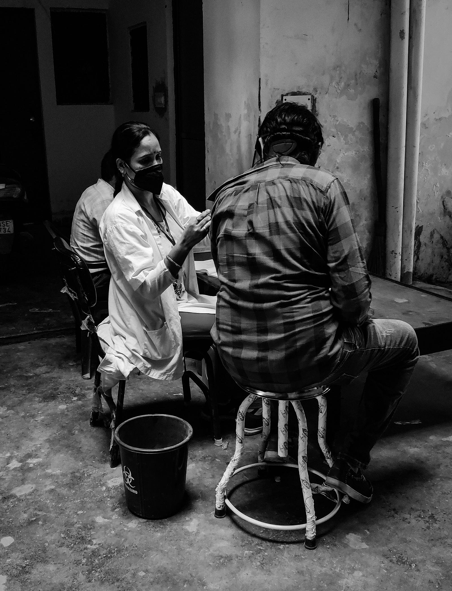

```{r setup, include=FALSE}
knitr::opts_chunk$set(
  fig.align = "center",
  out.width = "100%",
  tidy = "styler",
  warning = FALSE,
  message = FALSE
)

set.seed(42)
```

{width=100%}

I am happy to share that an article I contributed to has just been published in *Vaccine* [@TRUONG2026128349]:

> **Effectiveness of pneumococcal conjugate vaccines against invasive pneumococcal disease in Vietnamese children prior to national introduction: A matched case-control study**

🔗 https://doi.org/10.1016/j.vaccine.2026.128349

## Background

*Streptococcus pneumoniae* remains a major cause of severe illness and death in young children worldwide. Pneumococcal conjugate vaccines (PCVs) have dramatically reduced invasive pneumococcal disease (IPD) in countries where they are part of national immunization programs.

In Vietnam, however, PCV10 and PCV13 have so far only been available in the private sector, resulting in relatively low and unequal coverage. Until now, real-world evidence on vaccine effectiveness in the Vietnamese context was limited.

## What this study did

We conducted a matched case–control study in southern Vietnam among children aged 2–59 months. 

- **Cases**: children hospitalized with culture-confirmed invasive pneumococcal disease  
- **Controls**: age- and neighborhood-matched community children  

## Main findings

- Both **PCV10 and PCV13 provided substantial protection** against vaccine-type IPD.
- Meaningful protection was observed **despite low coverage** and private-sector availability only.
- **Serotype 19A** was predominant among cases.
- We observed evidence of **waning protection over time**, suggesting the importance of appropriate booster schedules.

Together, these findings provide the first real-world effectiveness estimates from Vietnam and offer timely evidence to inform national decisions on vaccine introduction, product selection, and schedule design.

## Why this matters

Policy decisions about vaccine introduction often rely on data from high-income countries. However, epidemiological patterns, serotype distribution, vaccine uptake, and health system factors can differ substantially across settings.

Generating **local effectiveness evidence** is therefore crucial for evidence-based public health decisions.

With Vietnam preparing for national PCV introduction, these results contribute to a stronger empirical foundation for implementation.

## Acknowledgments

I am grateful to Niko Speybroeck and Hieu Cong Truong for including me in this research project, and all co-authors and collaborators in Vietnam and Belgium for the excellent teamwork behind this study.

I hope this paper will, to some extent, be helpful for your research.

As always, if you have any question related to the topic covered in this paper, please add it as a comment so other readers can benefit from the discussion.

## References